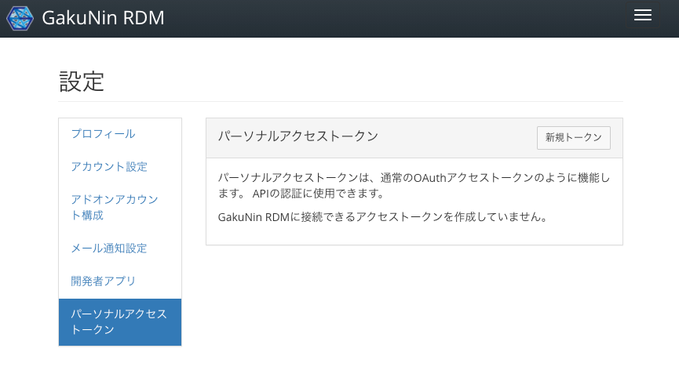
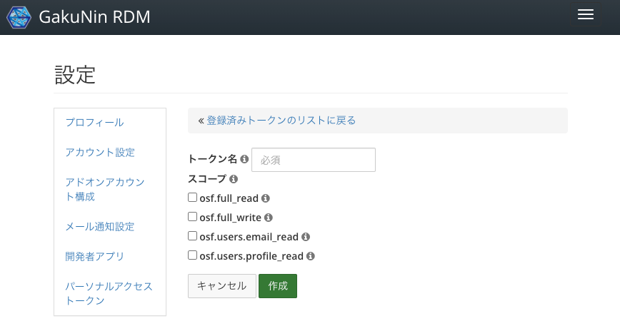
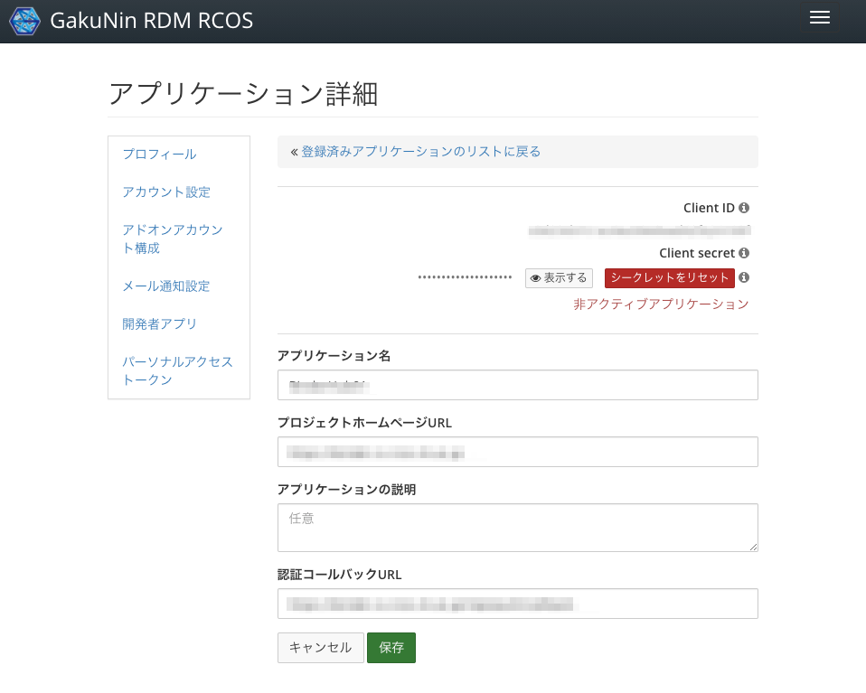

# APIの利用

RDMが研究データを効果的に管理するためには、外部システムとの連携や既存のRDMアドオンとの連携を行う必要が出てくるでしょう。
このような時、外部システムやRDMおよびアドオンの間の境界面、特にAPI(Application Programming Interface)を意識しながら機能を実装することで、メンテナンス性を維持したり、今後の拡張を容易にしたりすることができます。

本ドキュメントではアドオンにおける実装に着目し、アドオンを外部システムから操作可能にする方法([アドオンAPIの公開](#アドオンAPIの公開))と、アドオンからRDMを操作する方法([既存APIによる操作](#既存APIによる操作))の2つの観点で説明します。

# アドオンAPIの公開

アドオンの機能に対して、他のシステムからアクセス可能にするためのAPIの考え方、定義方法を説明します。

## APIの実装

外部システムがアドオンの機能に対してアクセスする場合は、HTTP(S)によるRESTful API呼び出しを利用するのが便利です。
RDMアドオンは [スケルトン](../Skelton) の追加方法で説明したように、Djangoアプリケーションの形で実装されます。
そのため、DjangoやRDMが提供する各種補助機能を利用することができます。

HTTP(S)で呼び出し可能なエンドポイントを定義する場合、ビューにより実装するのが一般的です。
[スケルトンの作成#Viewの構成](../Skelton#viewの構成) に示すように、定義は以下の2種類から構成されます。

- Routes ... View処理をどのパスにマッピングし、どのような形式で出力するか。出力にはJSON形式や、HTMLのテンプレートを指定することができる
- Views ... View処理の内容

Routesは以下のようにパスとMethod(GET, POST, PUT, DELETE, ...)と、その組み合わせに対してどの関数を実行するか、その実行結果をどのように出力するかを定義します。
例えば、[画面拡張の例](../ScreenExpansion)では以下のように定義しています。

```
api_routes = {
    'rules': [
        ...
        Rule([ # (1)
            '/project/<pid>/{}/config'.format(SHORT_NAME),
            '/project/<pid>/node/<nid>/{}/config'.format(SHORT_NAME),
        ], 'get', views.myscreen_get_config_ember, json_renderer),
        Rule([ # (2)
            '/project/<pid>/{}/config'.format(SHORT_NAME),
            '/project/<pid>/node/<nid>/{}/config'.format(SHORT_NAME),
        ], 'patch', views.myscreen_set_config_ember, json_renderer),
        ...
    ],
}
```

ルール(1)は、`/project/<pid>/アドオン名/config` というエンドポイントへの`GET`リクエストに対する処理を、viewsモジュールで定義した`myscreen_get_config_ember`という関数に行わせることを定義しています。`json_renderer`は、関数の戻り値として返されたオブジェクトを
JSONに変換、レスポンスとして返すことを定義しています。
同様に、ルール(2)は`PATCH`リクエストに対しては`myscreen_set_config_ember`で処理することを示しています。

Viewsでは、以下のように関数を定義しています。

```
@must_be_valid_project
@must_have_permission('admin')
@must_have_addon(SHORT_NAME, 'node')
def myscreen_get_config_ember(**kwargs):
    node = kwargs['node'] or kwargs['project']
    addon = node.get_addon(SHORT_NAME)
    return {'data': {'id': node._id, 'type': 'myscreen-config',
                     'attributes': {
                         'param1': addon.get_param_1()
                     }}}

@must_be_valid_project
@must_have_permission('admin')
@must_have_addon(SHORT_NAME, 'node')
def myscreen_set_config_ember(**kwargs):
    node = kwargs['node'] or kwargs['project']
    addon = node.get_addon(SHORT_NAME)
    try:
        config = request.json['data']['attributes']
        param_1 = config['param1']
    except KeyError:
        raise HTTPError(http_status.HTTP_400_BAD_REQUEST)

    addon.set_param_1(param_1)
    return {'data': {'id': node._id, 'type': 'myscreen-config',
                     'attributes': {
                         'param1': param_1
                     }}}
```

いずれも、`@must_`から始まるデコレータと、`def`から始まる関数定義ブロックから構成されます。
デコレータは、これらの関数に関する認可の要否や、使用可能なプロジェクトの条件を定義しています。
また、`kwargs`には関数に与えられた引数が格納されます。`node`や`project`には、Django Modelが格納されます。
(デコレータの定義によっては、格納されない場合もあります。)
アドオンはこれらのオブジェクトを介して、RDM内のデータベースの内容を操作することができます。
([画面拡張の例](../ScreenExpansion)では、Emberで定義した画面からこれらのエンドポイントに対してリクエストを出しています。)

これらのロジックの記述方法は一般的なDjangoのルールに則っています。したがって、DjangoやFlaskなどのPythonの
Webアプリケーションフレームワークの知識があれば比較的簡単に実装することができるでしょう。
また、RDMではアクセス制御やプロジェクトの制限に便利なデコレータを提供しています。[RDMが提供するデコレータ一覧](Decorators.md)を参考にしてください。


## APIのセキュリティ

APIアクセスは適切なユーザ、またはシステムからのみ利用可能なようにアクセス制御を行う必要があります。
アクセス制御方式の実現方法として、ユーザによる認可を経てアクセスを行う方式と、独自のセキュリティ機構を設ける方式について説明します。

### ユーザによる認可

先のViewsの例では、 `@must_have_permission('admin')` という形で、この操作は`admin`権限を持っているユーザにしか実施できないことを宣言しています。
他にも、`write`権限が必要であるとか、様々な権限のコントロールが考えられます。

ここで重要なのは、**ユーザによって、操作可能な範囲が異なる**という点と、**ユーザはアドオンを無制限に信頼してくれるわけではない**という点です。
ユーザの識別はWebアプリケーションにとっては当たり前のことですが、APIによる操作を考える場合にも非常に重要な点となります。
ただ、APIのリクエスト側に*「私はxxです」*という申告を求めるわけにはいきません。詐称される可能性があるからです。
また、秘密の情報(パスワード・秘密鍵等)で操作の主が認証できたとしても、そのユーザはこのアドオンを無制限に信頼してくれると考えるべきではありません。
(RDM自体は信頼して使ってもらうことになりますが、RDMのAPIにアクセスするソフトウェアは信頼されているとは限りません。)
そのため、「このアドオンは情報yyの読み込みだけをします」であるとか、「読み込みと書き込みをします」であるとか、範囲を限定してユーザへの許可を求めることになります。

#### Personal Access Tokenによる認可

このような、ユーザの権限を行使するための機構の一つが、Personal Access Tokenです。RDMのユーザの [設定] 画面から、 [パーソナルアクセストークン] で取得することができます。



[新規トークン] ボタンをクリックすると、新規トークンを発行することができます。



新規トークンの発行の際に、スコープという複数のチェック項目が現れます。これが認可の範囲を示しています。(詳細は [スコープの定義](#スコープの定義) を参照してください。)
[作成] ボタンをクリックして得たトークン(Access Token)はアプリケーションなどから`Authorization: Bearer`ヘッダを通して与えることで、APIにアクセスすることができるようになります。このようにすると、トークンの発行主の持つ権限と、(必要に応じて)スコープにより定義された認可範囲、 `@must_have_permission` などのデコレータによって定義された制約の検証が行われ、アクセスの許可・不許可が決定されます。

この方法は後述する [OAuthによる認可](#OAuthによる認可) 方式と異なり、Callback URLなどの準備が不要な一方、ユーザによるアクセストークン発行が必要なこと、そのアクセストークンが漏洩した際にユーザの協力を得ながら解決する必要があることなどから、開発中に利用できる便利な方式程度に考えるべきでしょう。

#### OAuthによる認可

Personal Access Tokenはユーザに手動でトークンを作成させ、トークンを何らかの方式でアプリケーションに渡す必要がありますが、RDMはOAuth https://tools.ietf.org/html/rfc6749 をサポートしており、OAuthによりアプリケーションとRDMの間で認可情報のやりとりを実現することができます。

アプリケーションがOAuthを通じてユーザから操作の認可を得るためには、RDMからConsumer KeyとConsumer Secretという情報を得る必要があります。
この情報は、RDMのユーザの [設定] 画面から、 [開発者アプリ] で取得することができます。



APIに対してアクセスするアプリケーションは、OAuth 2.0に対応したクライアントライブラリを用いてOAuth認可フローを実装する必要があります。
アプリケーションはOAuth認可フローを通して、ユーザにRDMへのログインと認可を求め、認可されるとAccess Token(または、要求した`access_type`が`offline`の場合、Refresh TokenとAccess Token)を取得することができます。あとはPersonal Access Tokenと同様に、`Authorization: Bearer`ヘッダにAccess Tokenを与えることで、APIアクセスを行うことができます。

頻繁に利用される可能性があるAccess Tokenは、悪用を防ぐために短時間(1時間)で期限切れとなるよう設計されています。そのため、認可を受けてから、長期間にわたってその認可された操作を実施したい場合は、Refresh Tokenを用いてAccess Tokenを定期的に新規取得する必要があります。
これらの処理は、多くの場合OAuth対応クライアントライブラリにロジックが用意されており、RDMが提供するエンドポイントのURLを与えれば実現できます。
(参考: エンドポイントの情報や可能な操作は https://github.com/RCOSDP/RDM-cas-overlay#web-server-authorization に記載されている。)

> OAuthを用いたAPIの認可をローカル環境で試すためには、開発環境構築時に [cas-overlayを含む構成で起動する](../Environment.md#cas-overlayを含む構成で起動する) 必要があります。

### 独自方式によるアクセス制御: Signing API requestsの例

RDMはアドオンに関してサンドボックスのような隔離モデルは採用しておらず、アドオンからRDM本体と同様の操作が実施することができます。
これは、様々な処理をアドオンとして実現できる一方、その強力な自由度を悪用されないよう、アドオンでは適切な権限制御を行う必要があります。

先に示したのはユーザの認可を経て処理を実施する方式ですが、アドオンによっては、必ずしも操作主体となるユーザを限定しない形で振舞う必要があるかもしれません。
このような場合に関してRDMは特別なセキュリティ機構を提供していないため、独自に外部システム(アドオン呼び出し元)とアドオンの間で取り決めをし、不正なユーザがアクセスすることができないようにセキュリティ機構を実装する必要があります。

このような機構を実現する場合に最も簡単な方法は、第三者が推測しにくいトークンを外部システムとアドオンの間で決め、アドオンはこのトークンをともなうリクエストのみを許可する方式です。
この方式は実現が容易な一方、中間者攻撃などリクエストの内容が奪われてしまうとこのトークンも漏洩してしまうという問題があります。(攻撃者は秘密のトークンを用いて自由にアドオンを操作できてしまう。)

このような攻撃への対策として、秘密のトークンそのものをリクエストに含めるのではなく、秘密のトークンと、その他の情報を合わせたハッシュ値を計算し、そのハッシュをリクエストに含めることが考えられます。これにより、受信側は同様のハッシュ計算を行なって送信側のハッシュ値との比較を行うことで、送信側が秘密のトークンを所持しているかを検証することができます。

例として、IQB-RIMSアドオンの場合は、アドオンの設定情報に基づいたハッシュを生成し、独自のHTTPヘッダ `X-RDM-Token` に格納するようにしています。
これにより、あるプロジェクトにアタッチされたアドオンにおいてハッシュが漏洩したとしても、別のアドオンに対して悪用はできないように配慮しています。
ハッシュ生成処理は、[RDMが提供するデコレータ一覧](Decorators.md)のようにデコレータとして定義することで、再利用性を高めています。

```
def must_have_valid_hash():
    """Decorator factory that ensures that a request have valid X-RDM-Token header.
    :returns: Decorator function
    """
    def wrapper(func):

        @functools.wraps(func)
        def wrapped(*args, **kwargs):
            owner = kwargs['node']
            addon = owner.get_addon(IQBRIMSAddonConfig.short_name)
            if addon is None:
                raise HTTPError(http.BAD_REQUEST)
            secret = addon.get_secret()
            process_def_id = addon.get_process_definition_id()
            valid_hash = hashlib.sha256((secret + process_def_id + owner._id).encode('utf8')).hexdigest()
            request_hash = request.headers.get('X-RDM-Token', None)
            logger.debug('must_have_valid_hash: request_hash={}'.format(request_hash))
            logger.debug('must_have_valid_hash: valid_hash={}'.format(valid_hash))
            if request_hash != valid_hash:
                raise HTTPError(
                    http.FORBIDDEN,
                    data={'message_long': ('User has restricted access to this page.')}
                )
            return func(*args, **kwargs)

        return wrapped

    return wrapper
```
(引用: https://github.com/RCOSDP/RDM-osf.io/blob/develop/addons/iqbrims/utils.py#L142)

このように定義した独自の `addons.iqbrims.utils.must_have_valid_hash` デコレータを用いて、
個々のViewsへのアクセスの際にハッシュ値の計算・設定が必要なことを明示しています。

```
@must_be_valid_project
@must_have_addon(SHORT_NAME, 'node')
@must_have_valid_hash()    # Hashの設定が必要なことを示す
def iqbrims_post_workflow_state(**kwargs):
    node = kwargs['node'] or kwargs['project']
    ...    # Viewsの処理
```
(引用: https://github.com/RCOSDP/RDM-osf.io/blob/develop/addons/iqbrims/views.py#L229)

これらのハッシュ計算にどの程度のリスクを想定するかは利用形態によって異なります。例えば、Amazon S3のSigning and authenticating REST requests https://docs.aws.amazon.com/AmazonS3/latest/dev/RESTAuthentication.html では、送信時刻を含むリクエストヘッダをハッシュ計算の対象に含めることで、ハッシュ値を含むリクエストが漏洩しても、同じオブジェクトに対するリクエストは以後不可能なように配慮がなされています。ハッシュ値の計算にどのような要素を使うかはアドオンの実装に依存する部分ではありますが、たとえリクエストが漏洩したとしても、その影響範囲がある程度限定的になるよう配慮してハッシュ計算を実装する必要があるでしょう。


# 既存APIによる操作

RDMは多くの機能をAPIとして提供しているため、すでにある機能については積極的に活用すべきでしょう。また、内部ではDjangoの規則にしたがって作成されたDjango Modelを介してデータベースの管理を行なっているため、この本章では、OSF APIv2による操作とDjango Modelによるモデルの直接操作に関して説明します。

## OSF APIv2 による外部からの操作

OSF APIv2はRDMが備えるRESTful APIです。OSF APIv2ドキュメント https://developer.osf.io/ で説明されている通り、プロジェクトに対して様々な操作を実施することができます。

これらのAPIは外部システムからの呼び出しに利用される他、Emberベースのアプリケーションからの操作にも利用されます。また、JSON-API https://jsonapi.org/format/1.0/ に準拠した形式で提供されます。

### スコープの定義

APIの操作にはOAuthにて説明したように、適切なスコープを指定する必要があります。
RDMにて指定可能なスコープは `oauth_scopes.public_scopes` として定義されます。

- https://github.com/RCOSDP/RDM-osf.io/blob/develop/framework/auth/oauth_scopes.py#L291-L363

これらのスコープは`CoreScopes` https://github.com/RCOSDP/RDM-osf.io/blob/develop/framework/auth/oauth_scopes.py#L23 の組み合わせとして表現されます。
それぞれの操作がどのようなスコープを要求するかは、Viewクラスに定義されます。例えば、NodeListに関する操作 ( https://developer.osf.io/#operation/nodes_list や https://developer.osf.io/#operation/nodes_create ) であれば、

```
class NodeList(JSONAPIBaseView, bulk_views.BulkUpdateJSONAPIView, bulk_views.BulkDestroyJSONAPIView, bulk_views.ListBulkCreateJSONAPIView, NodesFilterMixin, WaterButlerMixin, NodeOptimizationMixin):
    """The documentation for this endpoint can be found [here](https://developer.osf.io/#operation/nodes_list).
    """
    permission_classes = (
        drf_permissions.IsAuthenticatedOrReadOnly,
        base_permissions.TokenHasScope,
    )
    required_read_scopes = [CoreScopes.NODE_BASE_READ]
    required_write_scopes = [CoreScopes.NODE_BASE_WRITE]
    model_class = apps.get_model('osf.AbstractNode')

    parser_classes = (JSONAPIMultipleRelationshipsParser, JSONAPIMultipleRelationshipsParserForRegularJSON,)
    serializer_class = NodeSerializer
    ...
```
(引用: https://github.com/RCOSDP/RDM-osf.io/blob/develop/api/nodes/views.py#L228-L229)

のように、 `required_read_scopes` と `required_write_scopes` として、必要なスコープが定義されます。


## Django Modelによる内部からの操作

RDMはDjangoアプリケーションとして構成されているため、データベースへのアクセスはDjango Modelを介して行います。
この操作の例として、`django.dispatch.receiver` によるモデル変更検知と、 `osf.models` 内のオブジェクトを介した操作例を示します。

```
from django.dispatch import receiver
...
from osf.models import Contributor, RdmAddonOption, AbstractNode

...

@receiver(post_save, sender=Node)
def add_iqbrims_addon(sender, instance, created, **kwargs):
    if IQBRIMSAddonConfig.short_name not in ws_settings.ADDONS_AVAILABLE_DICT:
        return

    inst_ids = instance.affiliated_institutions.values('id')
    addon_option = RdmAddonOption.objects.filter(
        provider=IQBRIMSAddonConfig.short_name,
        institution_id__in=Subquery(inst_ids),
        management_node__isnull=False,
        is_allowed=True
    ).first()
    if addon_option is None:
        return
    if addon_option.organizational_node is not None and \
            not addon_option.organizational_node.is_contributor(instance.creator):
        return

    instance.add_addon(IQBRIMSAddonConfig.short_name, auth=None, log=False)
```
(引用: https://github.com/RCOSDP/RDM-osf.io/blob/develop/addons/iqbrims/models.py#L309-L327)

以下で、注目すべきコードについてそれぞれ説明します。

### receiverによるモデル変更検知

`django.dispatch.receiver` デコレータを用いることで、特定のModelに変更が生じた場合の処理を記述することができます。

```
@receiver(post_save, sender=Node)
def add_iqbrims_addon(sender, instance, created, **kwargs):
    ...
```

この例の場合は、`post_save`を指定していますので、Node型(プロジェクトはこの型のオブジェクトで表現されます)を持つオブジェクトの更新後に、`add_iqbrims_addon`関数が呼び出されます。

> `post_save`のほか、検知可能な変更操作は、 https://docs.djangoproject.com/en/3.1/ref/signals/ に列挙されています。
> RDM内では、 `pre_save`, `post_save`, `post_delete`, `m2m_changed` がすでに使用されています。

### osf.modelsによるモデル操作

`django.dispatch.receiver(post_save, sender=Node)` デコレータの場合は、第2引数の `instance` オブジェクトにNodeへの参照が格納されます。
Django Modelは `osf.models` に定義してあります。例えば Node Modelならば、 https://github.com/RCOSDP/RDM-osf.io/blob/develop/osf/models/node.py#L2457 で定義されています。

例えば、プロジェクト内で特定のアドオンを有効化したい場合は、 `add_addon`関数 https://github.com/RCOSDP/RDM-osf.io/blob/develop/osf/models/node.py#L2290 を呼び出すことで実現できます。

```
@receiver(post_save, sender=Node)
def add_iqbrims_addon(sender, instance, created, **kwargs):
    ...

    instance.add_addon(IQBRIMSAddonConfig.short_name, auth=None, log=False)
```

このようにして、直接Modelを操作することで、RDMに対して様々な作用を与えることができます。
モデル操作は自由に変更を行える一方、ユーザがこれらの変更を適切に理解できるようにする配慮を行う必要があります。
さもないと、「何かが勝手に自身のプロジェクトを壊した」と思ってしまうかもしれません。アドオンが、ユーザ自身に許可された範囲で様々な変更を実施しているように、ユーザに理解してもらえるような動作を設計することが重要です。
