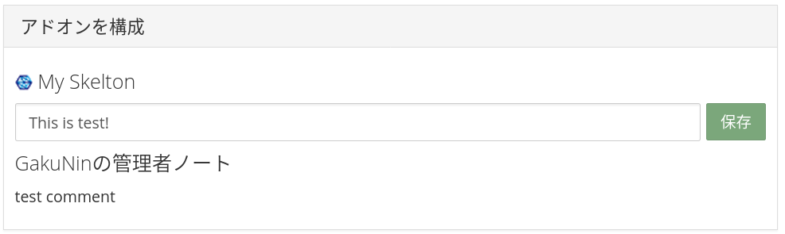

# アドオンの機関管理機能の利用

ユーザの所属機関が管理できる「機関管理機能」において、アドオンに関する機能(RDM Addon)について説明します。

具体的には、以下の方法を説明します。

- アドオンに共通する機関管理機能を、新しく追加したアドオンで利用できるようにする方法 ([スケルトン アドオンの機関管理機能の対応](#スケルトン-アドオンの機関管理機能の対応))
- 機関管理機能に新しい機能を追加する方法 ([Admin Notesの実装](#admin-notesの実装))

すべてのアドオンに共通する機関管理機能は、現在(2021年2月執筆時点)、アドオンの無効化機能のみです。機関ごとに、指定したアドオンを無効にすることができます。無効なアドオンは、ユーザーやプロジェクトのアドオン設定画面に表示されなくなり、利用もできなくなります。

## 前提条件

[開発環境の準備](../Environment.md#開発環境でRDMを起動する) のガイドに従い、開発環境にてRDMを起動しているものとします。

> 本ガイドでは機関管理機能を利用するため、`admin` と `admin_assets` サービスも起動してください。

動作確認のためのユーザは、 [開発環境の準備#ユーザを機関に所属させる](../Environment.md#ユーザを機関に所属させる) および [開発環境の準備#adminアクセス可能なユーザへと変更する](../Environment.md#adminアクセス可能なユーザへと変更する) のガイドに従い、何かしらの機関に所属し、その機関の機関管理者であるとします。


# アドオンの機関管理機能の設計

## ファイルの構成

機関管理機能もアドオンと同様に[Django](https://www.djangoproject.com/)アプリケーションの形式で記述されます。ただし、OSF.io本体やアドオンとは若干中身が異なります。

アドオンの機関管理機能(RDM Addon)の基本的なファイル配置は以下のようになります(Force to useに関するファイルは記載していません)。

```
/admin/
├── rdm_addons ... アドオンの機関管理機能のモジュール
│   ├── api_v1 ... APIモジュール
│   │   ├── __init__.py ... モジュールの定義
│   │   ├── urls.py ... APIのViewのルーティング定義
│   │   └── views.py ... APIのViewの定義
│   ├── __init__.py ... モジュールの定義
│   ├── decorators.py ... デコレーターの定義
│   ├── urls.py ... Viewのルーティング定義
│   ├── utils.py ... ユーティリティ関数の定義
│   └── views.py ... Viewの定義
├── static ... Webブラウザから読み込むことを想定した静的ファイル
│   ├── css/rdm_addons.css ... アドオンの機関管理機能設定のCSSファイル
│   └── rdm_addons ... アドオンの機関管理機能設定のJavaScriptディレクトリ
│       ├── アドオン名 ...アドオンごとのJavaScriptディレクトリ
│       │   ├── アドオン名RdmConfig.js ... アドオンごとの機関管理機能設定の定義
│       │   └── rdm-cfg.js ... アドオンごとの機関管理機能設定のエントリとなるJavaScriptファイル
│       ├── rdm-addons-page.js ... アドオンの機関管理機能設定のエントリとなるJavaScriptファイル
│       └── rdmAddonSettings.js ... アドオンの機関管理機能設定の定義
├── templates ... テンプレートディレクトリ
│   └── rdm_addons ... アドオンの機関管理機能設定のテンプレートディレクトリ
│       ├── addons ... アドオンごとのテンプレートディレクトリ
│       │   └── アドオン名_institution_settings.html ... アドオンの機関管理機能設定のテンプレートファイル
│       ├── addon_list.html ... アドオン一覧画面のテンプレートファイル
│       └── institution_list.html ... 機関一覧画面のテンプレートファイル
└── translations ... 国際化ディレクトリ
    ├── en/LC_MESSAGES ... 英語の国際化ディレクトリ
    │   └── django.po ... 機関管理画面のテンプレートの国際化設定ファイル
    ├── ja/LC_MESSAGES ... 日本語の国際化ディレクトリ
    │   └── django.po ... 機関管理画面のテンプレートの国際化設定ファイル
    └── django.pot ... 機関管理画面のテンプレートの国際化設定ファイル
```

機関管理機能のモデル定義は `/osf/models/` 以下に置きます。

```
/osf/models/
└── rdm_addons.py ... アドオンの機関管理機能設定のモデル定義
```

JavaScriptで使う国際化設定は `/website/translations/` 以下のファイルに記述します。

```
/website/translations/
├── en/LC_MESSAGES ... 英語の国際化ディレクトリ
│   └── js_messages.po ... 機関管理機能のJavaScriptで使う国際化設定ファイル
├── ja/LC_MESSAGES ... 日本語の国際化ディレクトリ
│   └── js_messages.po ... 機関管理機能のJavaScriptで使う国際化設定ファイル
└── js_messages.pot ... 機関管理機能のJavaScriptで使う国際化設定ファイル
```

テストファイルは `/admin_tests/` 以下に置きます。

```
/admin_tests/
└── rdm_addons ... アドオンの機関管理機能設定のテスト
    ├── api_v1
    │   ├── __init__.py
    │   └── test_views.py
    ├── __init__.py
    ├── factories.py
    └── test_views.py
```

## アドオンの機関管理機能のモジュール構成

アドオンと同様、Djangoの作法に従い、Model-Viewアーキテクチャにより実装します。

### Modelの構成

機関ごとのアドオンの設定を保持する `RdmAddonOption` モデルおよび `RdmAddonNoInstitutionOption` モデルが [osf/models/rdm_addons.py](https://github.com/RCOSDP/RDM-osf.io/blob/develop/osf/models/rdm_addons.py) に定義されています。設定項目を追加する場合は、これらモデルを変更します。

### Viewの構成

Viewの定義方法はアドオンと異なっているように見えますが、基本的な考え方は同じです。

ルーティング(アドオンにおける`routes.py`)は [admin/rdm_addons/urls.py](https://github.com/RCOSDP/RDM-osf.io/blob/develop/admin/rdm_addons/urls.py) に定義し、各View処理は [admin/rdm_addons/views.py](https://github.com/RCOSDP/RDM-osf.io/blob/develop/admin/rdm_addons/views.py) に定義します。

APIに関するView定義は、 [admin/rdm_addons/api_v1/urls.py](https://github.com/RCOSDP/RDM-osf.io/blob/develop/admin/rdm_addons/api_v1/urls.py) と [admin/rdm_addons/api_v1/views.py](https://github.com/RCOSDP/RDM-osf.io/blob/develop/admin/rdm_addons/api_v1/views.py) に定義します。

### フレームワークによって提供されるView

HTMLテンプレートとJavaScriptの定義方法や、利用できるライブラリは、アドオンと似ています。

HTMLテンプレートファイルは [admin/templates/rdm_addons/](https://github.com/RCOSDP/RDM-osf.io/tree/develop/admin/templates/rdm_addons) 以下に配置します。拡張子が`.html`ですが、アドオンと同様に、テンプレート言語 [mako](https://www.makotemplates.org/) で記述します。  
各アドオンに関する設定画面のテンプレートファイルは、デフォルトで [admin/templates/rdm_addons/addons/institution_settings_default.html](https://github.com/RCOSDP/RDM-osf.io/blob/develop/admin/templates/rdm_addons/addons/institution_settings_default.html) が使用されます。個別にテンプレートファイルを指定する方法は [#UI の追加](#uiの追加) で説明します。

各画面で読み込むJavaScriptファイルは [admin/static/js/rdm_addons/](https://github.com/RCOSDP/RDM-osf.io/tree/develop/admin/static/js/rdm_addons) 以下に配置します。テンプレートを動的に操作するためのJavaScriptのライブラリには [Knockout.js](https://knockoutjs.com/) を利用することができます。  
アドオンと違い、追加したエントリーファイルは [admin/webpack.admin.config.js](https://github.com/RCOSDP/RDM-osf.io/blob/develop/admin/webpack.admin.config.js) の `entry` プロパティに追加する必要があることに注意してください。設定方法は [#UI の追加](#uiの追加) で説明します。

各画面に関するスタイル定義は [admin/static/css/rdm_addons.css](https://github.com/RCOSDP/RDM-osf.io/blob/develop/admin/static/css/rdm_addons.css) にまとめて記述します。

> 機関管理者画面では、ember-osf-webで利用できるようなUI Componentは提供されていませんが、 [Bootstrap3](https://getbootstrap.com/docs/3.3/) のCSSやコンポーネントを利用することができます。

### テストコード

テストコードは [admin_tests/rdm_addons](https://github.com/RCOSDP/RDM-osf.io/tree/develop/admin_tests/rdm_addons) 以下に作成します。

### Migrations定義

Migrationsファイルは [osf/migrations](https://github.com/RCOSDP/RDM-osf.io/tree/develop/osf/migrations) 以下に作成されます。Migrationsファイルの構造はアドオンと同様です。

### 国際化

HTMLテンプレートで使う国際化設定は [admin/translations/](https://github.com/RCOSDP/RDM-osf.io/blob/develop/admin/translations/) 以下の `django.pot` および `django.po` に定義します。

JavaScriptで使う国際化設定は [website/translations/](https://github.com/RCOSDP/RDM-osf.io/blob/develop/website/translations/) 以下の `js_messages.pot` および `js_messages.po` に定義します。

定義方法や使い方は、 [ScreenExpansion#国際化](../ScreenExpansion/README.md#国際化) で説明しています。HTMLファイル内で文字列を国際化する方法は、makoと同様です。

> JavaScriptだけ、`website/translations/` 以下のファイルに定義することに気をつけてください。


# スケルトン アドオンの機関管理機能の対応

`myskelton` という識別名のアドオンを、機関管理機能で管理するための実装を例に説明します。

[スケルトンの作成#スケルトン アドオンの実装](../Skelton/README.md#スケルトン-アドオンの実装) に従い、スケルトン アドオンの実装が完了していることを前提とします。

## addons.myskelton モジュールの変更

> ストレージアドオンの場合、この変更は不要です。

機関管理機能で管理するアドオンは、`AppConfig.config` に `accounts` が含まれている必要があります。  
`AppConfig.config` に `accounts` が含まれているアドオンは、ユーザのアドオンアカウント構成画面に表示され、デフォルトではOAuthの認証設定UIを含むテンプレートが参照されます。スケルトン アドオンは認証設定が不要なので、アドオン名を表示するだけのテンプレートを定義して、それを参照するようにします。

まずは [user_settings.mako](addon/templates/user_settings.mako) を `addons/myskelton/templates/user_settings.mako` に、[user-cfg.js](addon/static/user-cfg.js) を `addons/myskelton/static/user-cfg.js` にコピーします。

次に、`addons/myskelton/apps.py` を以下のように変更します。  
変更例はサンプル [apps.py](addon/apps.py) を参照してください。

```diff
class AddonAppConfig(BaseAddonAppConfig):
 
-    configs = ['node']
+    configs = ['node', 'accounts']
 
     node_settings_template = os.path.join(TEMPLATE_PATH, 'node_settings.mako')
+    user_settings_template = os.path.join(TEMPLATE_PATH, 'user_settings.mako')

     # 他変更なし
```


## RDMコードの変更

### admin/base/settings/defaults.py への追加

[admin/base/settings/defaults.py](https://github.com/RCOSDP/RDM-osf.io/blob/develop/admin/base/settings/defaults.py) の `INSTALLED_APPS` にアドオン名を、`MIGRATION_MODULES` にキーがアドオン名のプロパティを追加します。

> `INSTALLED_APPS` に追加する値は `addons.アドオン名` ですが、`MIGRATION_MODULES` に追加するキー名は `addons_アドオン名` です。`.` と `_` の違いに注意してください。

デフォルトでは、Force to useという、機関に属するプロジェクトでアドオンを強制的に有効にする機能が利用できます。しかし、この機能を利用するためには、認証情報を保存するための仕組みをアドオンに実装しておく必要があります。スケルトン アドオンは認証情報を持たないため、`UNSUPPORTED_FORCE_TO_USE_ADDONS` にアドオン名を追加し、この機能を無効にします。

実装例はサンプル [defaults.py](config/admin/base/settings/defaults.py) を参照してください。


# スケルトン アドオンの機関管理機能の動作確認

スケルトン アドオンを機関管理機能で管理してみましょう。

変更したファイルに関連するサービスを再起動します。

```
$ docker compose restart web api assets admin
```

これでサービスへの反映は完了です。機関管理機能でスケルトン アドオンの設定を変更できることを確認するには、以下のような操作を実施します。

1. RDM Web UIにアクセスする `http://localhost:5000`
1. 「アドオンアカウント構成」ページを開く。
1. My Skeltonアドオンが表示されていることを確認する。
   
1. 機関管理機能のWeb UIにアクセスする `http://localhost:8001`
1. RDM Addonsページを開く。
1. 自分の所属機関のページを開く。
1. My Skeltonアドオンの左のチェックボックスを外し、アドオンを無効化する。
   
1. 再度、RDM Web UIで「アドオンアカウント構成」ページを開く。
1. My Skeltonアドオンが表示されていないことを確認する。

以上でスケルトン アドオンの機関管理機能の動作確認は完了です！


# Admin Notesの実装

ここでは、機関管理者が、スケルトン アドオンに関するユーザへの注意書きを設定できる Admin Notes という機能の実装を例に説明します。

[スケルトン アドオンの機関管理機能の対応](#スケルトン-アドオンの機関管理機能の対応) が完了していることを前提とします。

## RDMコードの変更

### RdmAddonOption モデルの変更

[osf/models/rdm_addons.py](https://github.com/RCOSDP/RDM-osf.io/blob/develop/osf/models/rdm_addons.py) の `RdmAddonOption` モデルおよび `RdmAddonNoInstitutionOption` モデルに、Admin Notesの内容を保存する `admin_notes` カラムを追加します。  
変更例はサンプル [rdm_addons.py](osf/models/rdm_addons.py) を参照してください。

### APIの追加

Admin Notesを取得・設定するためのAPIを追加します。

[admin/rdm_addons/api_v1/views.py](https://github.com/RCOSDP/RDM-osf.io/blob/develop/admin/rdm_addons/api_v1/views.py) に `AdminNotesView` クラスを追加します。  
変更例はサンプル [views.py](admin/rdm_addons/api_v1/views.py) を参照してください。

[admin/rdm_addons/api_v1/urls.py](https://github.com/RCOSDP/RDM-osf.io/blob/develop/admin/rdm_addons/api_v1/urls.py) に `AdminNotesView` へのルーティング設定を追加します。  
変更例はサンプル [urls.py](admin/rdm_addons/api_v1/urls.py) を参照してください。

### UIの追加

Admin Notesを設定するためのUIを追加します。
今回は、スケルトン アドオンに対してのみAdmin Notesを設定できるように、スケルトン アドオン用の設定UIを作成します。

以下に従って、テンプレートファイルとJavaScriptファイルをコピーします。

- [myskelton_institution_settings.html](admin/templates/rdm_addons/addons/myskelton_institution_settings.html) を `admin/templates/rdm_addons/addons/myskelton_institution_settings.html` にコピーする。
- [myskeltonRdmConfig.js](admin/static/js/rdm_addons/myskelton/myskeltonRdmConfig.js) を `admin/static/js/rdm_addons/myskelton/myskeltonRdmConfig.js` にコピーする。
- [rdm-cfg.js](admin/static/js/rdm_addons/myskelton/rdm-cfg.js) を `admin/static/js/rdm_addons/myskelton/rdm-cfg.js` にコピーする。

作成したテンプレートファイルを読み込むように、 [admin/rdm_addons/utils.py](https://github.com/RCOSDP/RDM-osf.io/blob/develop/admin/rdm_addons/utils.py) の `get_institusion_settings_template()` 関数の一部を変更します。  
変更例はサンプル [utils.py](admin/rdm_addons/utils.py) を参照してください。

作成したJavaScriptファイルを読み込むように、 [admin/webpack.admin.config.js](https://github.com/RCOSDP/RDM-osf.io/blob/develop/admin/webpack.admin.config.js) の `entry` に `rdm-myskelton-cfg` プロパティを追加します。  
変更例はサンプル [webpack.admin.config.js](config/admin/webpack.admin.config.js) を参照してください。

アドオンの機関管理機能UIで読み込まれるCSSファイル [admin/static/css/rdm_addons.css](https://github.com/RCOSDP/RDM-osf.io/blob/develop/admin/static/css/rdm_addons.css) に、Admin Notesに関するCSSを追加します。  
変更例はサンプル [rdm_addons.css](admin/static/css/rdm_addons.css) を参照してください。

## addons.myskelton モジュールの変更

Admin Notesの内容をプロジェクトの「アドオンを構成」ページに表示するための変更を加えます。

### APIの追加

Admin Notesを取得するためのAPIを追加します。

`addons/myskelton/views.py` に `myskelton_get_admin_notes` 関数を追加します。  
変更例はサンプル [views.py](addon/views.py) を参照してください。

`addons/myskelton/routes.py` に `myskelton_get_admin_notes` へのルーティング設定を追加します。  
変更例はサンプル [routes.py](addon/routes.py) を参照してください。

### UIの追加

Admin Notesを表示するためのUIを追加します。

`addons/myskelton/templates/node_settings.mako` にAdmin Notesを表示するテンプレートを追加します。  
変更例はサンプル [node_settings.mako](addon/templates/node_settings.mako) を参照してください。

`addons/myskelton/static/node-cfg.js` にAdmin Notesを読み込む関数とAdmin Notesの内容を保持する変数を追加します。  
変更例はサンプル [node-cfg.js](addon/static/node-cfg.js) を参照してください。

## 国際化

[website/translations/](https://github.com/RCOSDP/RDM-osf.io/tree/develop/website/translations) 以下のファイル `js_messages.*` の末尾に、Admin Notesに関する国際化設定を追加します。  
変更例はサンプル [website/translations/](website/translations/) を参照してください。

[admin/translations/](https://github.com/RCOSDP/RDM-osf.io/tree/develop/admin/translations) 以下の各ファイルの末尾に、Admin Notesに関する国際化設定を追加します。  
変更例はサンプル [admin/translations/](admin/translations/) を参照してください。

## テストファイルの変更

### admin_tests/rdm_addons/api_v1/test_views.py の変更

機関管理機能に追加したAPIのテストを追加します。

[admin_tests/rdm_addons/api_v1/test_views.py](https://github.com/RCOSDP/RDM-osf.io/blob/develop/admin_tests/rdm_addons/api_v1/test_views.py) に、Admin Notes取得・設定APIをテストする `TestAdminNotesView` クラスを追加します。  
変更例はサンプル [test_views.py](admin_tests/rdm_addons/api_v1/test_views.py) を参照してください。

### addons/myskelton/tests/test_view.py の変更

スケルトン アドオンのAdmin Notesの取得APIのテストを追加します。

`addons/myskelton/tests/test_view.py` に、Admin Notes取得APIをテストする `TestAdminNotesViews` クラスを追加します。  
変更例はサンプル [test_views.py](addon/tests/test_view.py) を参照してください。 

## Migrationsファイルの作成

makemigrations コマンドを実行して、Migrationsファイルを作成します。

```
$ docker compose run --rm web python3 manage.py makemigrations
```

上記の出力中に以下のような出力が現れれば成功です。

> `osf/migrations` 配下に作成されるファイル名は、作成日時やRDMのバージョンによって異なります。

```
Migrations for 'osf':
  osf/migrations/0214_auto_20210214_1431.py
    - Add field admin_notes to rdmaddonnoinstitutionoption
    - Add field admin_notes to rdmaddonoption
```

## テスト

アドオンの機関管理機能におけるAdmin Notesに関するユニットテストは、以下のコマンドで実行できます。

```
$ docker compose run --rm web invoke test_module -m admin_tests/rdm_addons/api_v1/test_views.py::TestAdminNotesView
```

スケルトン アドオンにおけるAdmin Notesに関するユニットテストは、以下のコマンドで実行できます。

```
$ docker compose run --rm web invoke test_module -m addons/myskelton/tests/test_view.py::TestAdminNotesViews
```

# Admin Notesの動作確認

Admin Notesの動作を確認してみましょう。

## DBマイグレーション

マイグレーションを実行し、Migrations定義をPostgreSQLサービスに反映します。

```
$ docker compose run --rm web python3 manage.py migrate
```

## 国際化のコンパイル

テンプレートファイルの国際化設定を適用するために、国際化ファイルをコンパイルします。

```
$ docker compose run --rm web pybabel compile -D django -d ./admin/translations
```

## サービスの再起動

変更したファイルに関するサービスを再起動します。

```
$ docker compose restart web api assets admin admin_assets
```

これでサービスへの反映は完了です。

## Admin Notesを試す

Admin Notesの設定および表示の確認をするには、以下のような操作を実施します。

1. 機関管理機能のWeb UIにアクセスする。 `http://localhost:8001`
1. アドオン利用制御(RDM Addons)ページを開く。
1. 自分の所属機関のページを開く。
1. My Skeltonアドオンの中の管理者ノート(Admin Notes)の下にあるテキストボックスに任意のテキストを入力し、保存する。
   
1. RDM Web UIにアクセスする。 `http://localhost:5000`
1. 適当なプロジェクトを作成する。
1. 「アドオン」ページを開く。
1. My Skeltonアドオンを有効化する。
1. 「アドオンを構成」のMy Skeltonの欄に、設定したAdmin Notesが表示されていることを確認する。
  

以上でAdmin Notesの動作確認は完了です！
