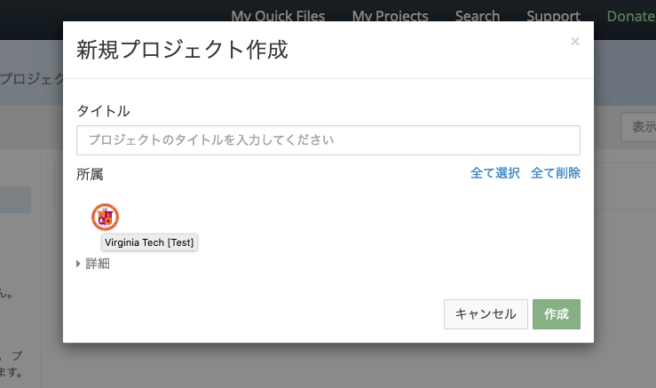

# 開発環境の準備

RDMは複数のマイクロサービスから構成されます。開発時にもこれらのサービスを動作させる必要がありますが、
1つ1つのサービスを自身のOSに合わせてインストールしようとすると非常に手間がかかります。

そのため、Docker Compose を用いて開発環境を構築する方法が [RDM-osf.ioドキュメント](https://github.com/RCOSDP/RDM-osf.io/blob/develop/README-docker-compose.md) にて説明されています。

Dockerを用いることで、OS等の環境の差異をコンテナにより吸収することができます。本ドキュメントでは [README-docker-compose.md](https://github.com/RCOSDP/RDM-osf.io/blob/develop/README-docker-compose.md) に補助的な説明を加えていきます。

# サービスの構成

`docker-compose.yml`に定義されているサービスは以下の通りです。


(Generated by https://github.com/pmsipilot/docker-compose-viz)

図中の円はポート番号, 矩形はサービスを示しています。
サービスは大きく分けて以下の5種類に分類できます。(括弧はインストールされるRCOSDP内リポジトリ)

* データ保存・共有サービス: postgres, elasticsearch, elasticsearch6, rabbitmq, mongo
* 基本サービス: web, api, admin, worker ([RDM-osf.io](https://github.com/RCOSDP/RDM-osf.io/)), wb, wb_worker ([RDM-waterbutler](https://github.com/RCOSDP/RDM-waterbutler/))
* UIサービス: ember_osf_web ([RDM-ember-osf-web](https://github.com/RCOSDP/RDM-ember-osf-web)), mfr ([RDM-modular-file-renderer](https://github.com/RCOSDP/RDM-modular-file-renderer)), unoconv, registries, preprints, reviews, sharejs
* テスト用認証サービス: fakecas
* ユーティリティサービス: requirements ([RDM-osf.io](https://github.com/RCOSDP/RDM-osf.io/)), mfr_requirements ([RDM-modular-file-renderer](https://github.com/RCOSDP/RDM-modular-file-renderer)), wb_requirements ([RDM-waterbutler](https://github.com/RCOSDP/RDM-waterbutler/)), assets, admin_assets ([RDM-osf.io](https://github.com/RCOSDP/RDM-osf.io/))

> GRDMでは preprints, registries は使用しません。

# 基本的な流れ

1. DockerとOSのセットアップ - https://github.com/RCOSDP/RDM-osf.io/blob/develop/README-docker-compose.md#docker-and-os-setup
  * Docker Composeを利用可能にするためにDocker Engineを自身の環境にインストールします。
  * RDMのサービス同士が互いに通信できるように、ループバックデバイスとして `192.168.168.167` を設定します。
2. アプリケーションの設定 - https://github.com/RCOSDP/RDM-osf.io/blob/develop/README-docker-compose.md#application-configuration
  * WebサーバとAPIサーバに関する、Djangoの設定ファイル `local.py` を準備します。特に変更の必要がなければ、それぞれの `local-dist.py` をコピーして使用します。
  * RDM-osf.io, RDM-waterbutlerリポジトリを使用するよう、Docker Composeサービス定義ファイルを変更します。`docker-compose.yml` を直接変更するのではなく、 `docker-compose.override.yml` を変更することで、誤って開発環境固有の情報をリポジトリにコミットすることを防止することができます。
3. アプリケーションの実行 - https://github.com/RCOSDP/RDM-osf.io/blob/develop/README-docker-compose.md#application-runtime
  * このDocker Compose環境は、Dockerイメージをベースに各サービスを起動しますが、PythonモジュールやNodeモジュールはイメージとは異なるボリュームに保持します。(開発中に更新される可能性を想定しているものと思われます。) そのため、サービス実行前に `docker-compose up requirements mfr_requirements wb_requirements` を実施することで、必要なライブラリを各コンテナにインストールする必要があります。
4. ツールの利用 - https://github.com/RCOSDP/RDM-osf.io/blob/develop/README-docker-compose.md#running-arbitrary-commands
  * DjangoのMigrationファイルの作成や、RDMが保持するModelの確認、テストの実行など、Docker Compose経由でコマンドを実行することで、容易にこれらのコマンドを実行できます。
5. 環境のリセット - https://github.com/RCOSDP/RDM-osf.io/blob/develop/README-docker-compose.md#cleanup--docker-reset
  * Dockerを使うことで得られる恩恵の1つは、開発環境をいつでもリセットできるという点です。開発時の試行錯誤の副作用の蓄積を簡単にリセットし、動作確認を確実に行うことができます。

# 開発環境のカスタマイズ

初期状態では `docker-compose.yml` は `quay.io/centerforopenscience/` からイメージを取得するようになっています。
この構成でも動作を確認できる可能性はありますが、開発中のブランチからイメージをビルドした方が、よりスムーズに動作確認できるかもしれません。

Docker Composeにより起動される各サービスのDockerイメージを、自身で開発しているイメージに差し替えるには、以下のような内容を `docker-compose.override.yml` に記述します。
(`docker-compose.yml` と同じディレクトリに作成してください。)

```
version: "3.4"

services:
  admin:
    image: myrepository/RDM-osf.io:mybranch
  admin_assets:
    image: myrepository/RDM-osf.io:mybranch
  api:
    image: myrepository/RDM-osf.io:mybranch
  assets:
    image: myrepository/RDM-osf.io:mybranch
  requirements:
    image: myrepository/RDM-osf.io:mybranch
  wb:
    image: myrepository/RDM-waterbutler:mybranch
  wb_requirements:
    image: myrepository/RDM-waterbutler:mybranch
  wb_worker:
    image: myrepository/RDM-waterbutler:mybranch
  web:
    image: myrepository/RDM-osf.io:mybranch
  worker:
    image: myrepository/RDM-osf.io:mybranch
  ember_osf_web:
    image: myrepository/RDM-ember-osf-web:mybranch
```

# 開発環境でRDMを起動する

## サービスを起動する

[Quickstart: Running all OSF services in the background](https://github.com/RCOSDP/RDM-osf.io/blob/develop/README-docker-compose.md#quickstart-running-all-osf-services-in-the-background) に示されているように、以下のコマンドでサービスを実行することができます。

```
# ライブラリのインストール - 初回/ライブラリ定義変更時だけ必要
$ docker-compose up requirements mfr_requirements wb_requirements
# DBのマイグレーション - 初回/DB定義変更時だけ必要
$ docker-compose run --rm web python3 manage.py migrate

$ docker-compose up -d assets admin_assets mfr wb wb_worker fakecas sharejs worker web api admin ember_osf_web
```

> https://github.com/RCOSDP/RDM-osf.io/blob/develop/README-docker-compose.md では preprints, registries の起動について紹介していますが、GRDMでは preprints, registries は提供しないため無視してください。

### シンプルな構成で起動する

動作確認したい内容に応じて、 mfr, admin_assets, admin, sharejs を除外することもできます。
例えば、fakecasで認証し、プロジェクト作成、ファイル管理を確認したいだけであれば、

```
# ライブラリのインストール - 初回/ライブラリ定義変更時だけ必要
$ docker-compose up requirements wb_requirements
# DBのマイグレーション - 初回/DB定義変更時だけ必要
$ docker-compose run --rm web python3 manage.py migrate

$ docker-compose up -d assets wb wb_worker fakecas worker web api ember_osf_web
```

でも十分でしょう。`docker-compose ps`で異常終了しているサービスがいないことを確認します。
`docker-compose ps`の出力例は以下の通りです。`docker-compose up -d`で指定したサービスが`Up`であることを確認します。

```
$ docker-compose ps
            Name                          Command               State                                              Ports                                           
-------------------------------------------------------------------------------------------------------------------------------------------------------------------
rdm2-osfio_api_1               docker-entrypoint.sh invok ...   Up       0.0.0.0:8000->8000/tcp                                                                    
rdm2-osfio_assets_1            docker-entrypoint.sh invok ...   Up                                                                                                 
rdm2-osfio_elasticsearch_1     /docker-entrypoint.sh elas ...   Up       0.0.0.0:9200->9200/tcp, 9300/tcp                                                          
rdm2-osfio_ember_osf_web_1     docker-entrypoint.sh /bin/ ...   Up       0.0.0.0:41953->41953/tcp, 0.0.0.0:4200->4200/tcp                                          
rdm2-osfio_fakecas_1           fakecas -host=0.0.0.0:8080 ...   Up       0.0.0.0:8080->8080/tcp                                                                    
rdm2-osfio_postgres_1          docker-entrypoint.sh /bin/ ...   Up       0.0.0.0:5432->5432/tcp                                                                    
rdm2-osfio_rabbitmq_1          docker-entrypoint.sh rabbi ...   Up       15671/tcp, 0.0.0.0:15672->15672/tcp, 25672/tcp, 4369/tcp, 5671/tcp, 0.0.0.0:5672->5672/tcp
rdm2-osfio_requirements_1      docker-entrypoint.sh /bin/ ...   Exit 0                                                                                             
rdm2-osfio_wb_1                invoke server                    Up       0.0.0.0:7777->7777/tcp                                                                    
rdm2-osfio_wb_requirements_1   /bin/bash -c invoke instal ...   Exit 0                                                                                             
rdm2-osfio_wb_worker_1         invoke celery                    Up       7777/tcp                                                                                  
rdm2-osfio_web_1               docker-entrypoint.sh invok ...   Up       0.0.0.0:5000->5000/tcp                                                                    
rdm2-osfio_worker_1            docker-entrypoint.sh invok ...   Up

```

### cas-overlayを含む構成で起動する

OAuth2の動作確認の際は、fakecasではなくcas-overlayを使ったテストが必要になります。このような場合には、以下のようにfakecasではなく cas サービスを起動します。

```
# ライブラリのインストール - 初回/ライブラリ定義変更時だけ必要
$ docker-compose up requirements wb_requirements
# DBのマイグレーション - 初回/DB定義変更時だけ必要
$ docker-compose run --rm web python3 manage.py migrate

$ docker-compose up -d assets wb wb_worker cas worker web api ember_osf_web
```

casはfakecasとは異なり、後述するユーザ作成手順で入力したパスワードがログインの際に必要になります。他の操作方法はfakecasと同様です。

## Web UIを開く

サービスが起動したことを確認したら、 `http://localhost:5000` にアクセスし動作を確認してみましょう。

ログは `docker-compose logs` コマンドで確認できます。ember_osf_webコンテナは起動にある程度時間がかかりますが、この状態を確認するには、以下のコマンドを入力します。

```
$ docker-compose logs -f ember_osf_web
...
Build successful (xxxxxms) – Serving on http://0.0.0.0:4200/
```

## テスト用ユーザを作成する

`http://localhost:5000` が正常に参照できたら、`Sign Up`を行いましょう。以下の手順で行います。

1. `Sign Up`ボタンを押し、ユーザ登録画面を開く
1. ユーザ登録画面に適当なユーザ名、Eメールアドレスとパスワードを入力する
1. デバッグログにEメール到達確認用のURL(`http://localhost:5000/confirm/xxxxx/xxxxxxxxxxxxxxxxxxxxxxxxxxxxxx/`)が出力されるので、 `docker-compose logs web` で確認する

  > 本番環境の場合はここでEメールアドレス宛に到達確認用のURLを含むメールが届きますが、SMTPサーバを指定していないのでメールは送信されません。

1. 到達確認用のURLをブラウザでアクセスする

> ブラウザはFirefoxを使用してください。Chromeの場合は、FakeCASとWeb UIの間でCookieが共有されず正常動作しない場合があります。

## 動作確認を実施する

これでユーザの作成は完了です。以降は、ログイン画面から、登録したEメールアドレスのみでログインできます。(開発用途に限定して利用してください。)

# コマンドの実行例

## ユニットテストを実行する

全てのユニットテストを実行するには、以下のようにコマンドを入力します。
`requirements` サービスによりテストに必要なライブラリがインストールされ、`invoke test`でテストが実行できます。

```
# 初回だけ必要
$ docker-compose up requirements

$ docker-compose run --rm web invoke test
```

テストコードを限定する方法は https://github.com/RCOSDP/RDM-osf.io/blob/develop/README-docker-compose.md#application-tests に記載されています。

## Migrationファイルを作成する

RDM-osf.ioはDjangoアプリケーションとして実装されています。モデルの変更を行った場合、適切にデータベーススキーマに変更が反映されるよう、Migrationsファイルを作成する必要があります。
以下のコマンドを入力することで、Djangoの管理コマンド `makemigrations` を実行できます。

```
$ docker-compose run --rm web python3 manage.py makemigrations
```

作成したMigrationsファイルは、以下のコマンドで `postgres`サービスに反映できます。

```
$ docker-compose run --rm web python3 manage.py migrate
```

## OAuth2スコープを登録する

*TBD*

```
docker-compose run --rm web python3 -m scripts.register_oauth_scopes
```

## ユーザを機関に所属させる

機関に関する機能を試すためには、ユーザを機関に所属させる必要があります。
このような場合は、以下の手順を実施してください。

まず、実行中のRDMのデータベースに機関の情報を登録します。これは初回だけ必要です。

```
$ docker-compose run --rm web python3 -m scripts.populate_institutions -e test -a
```

上記のコマンドを実行すると、`Virginia Tech [Test]` などの機関名を持つ機関が登録されます。

次に、shell機能を使って、ユーザに機関を紐付けます。以下のコマンドを実行します。

```
$ docker-compose run --rm web invoke shell
```

上記コマンドを実行すると、以下のようなプロンプトが現れますので、Pythonスクリプトで処理を指示します。下記のようにスクリプトを実行すると、指定したEmailアドレスを持つユーザのモデルを取得することができます。

```
In[1]: user = OSFUser.objects.get(username='登録したEmailアドレス')

In [2]: user
Out[2]: <OSFUser('登録したEmailアドレス') with guid '登録されたユーザID'>
```

ユーザが所属する機関のリストは、`user.affiliated_institutions`で管理されます。このリストに、先に登録した機関に対応する`Institution`オブジェクトを追加すると、ユーザを機関に所属させることができます。

```
# 機関名は例えば Virginia Tech [Test] 等: [i.name for i in Institution.objects.all()] で確認できる
In [4]: user.affiliated_institutions.add(Institution.objects.get(name='機関名'))
```

変数を編集したら、モデルに対して`save`メソッドを呼び出し、`commit`も忘れないようにしておきましょう。

```
In [5]: user.save()

In [6]: commit()
Transaction committed.
New transaction opened.
```

これでユーザを機関に所属させることができました。試しに、New Projectから新規プロジェクトの作成を実施してみましょう。所属のところに、Institutionで指定した機関が表示されます。



## adminアクセス可能なユーザへと変更する

管理者機能は `http://localhost:8001/` からアクセスすることができます。
ユーザがadminアクセス可能かどうかは `is_staff` プロパティで定義することができます。

`is_staff`の編集には、shell機能を使います。

```
$ docker-compose run --rm web invoke shell
```

shellから以下のようにコマンドを実行することで、指定したユーザの `is_staff` プロパティを変更することができます。

```
In[1]: user = OSFUser.objects.get(username='登録したEmailアドレス')

In [2]: user
Out[2]: <OSFUser('登録したEmailアドレス') with guid '登録されたユーザID'>

In [3]: user.is_staff = True

In [4]: user.save()

In [5]: commit()
Transaction committed.
New transaction opened.
```
