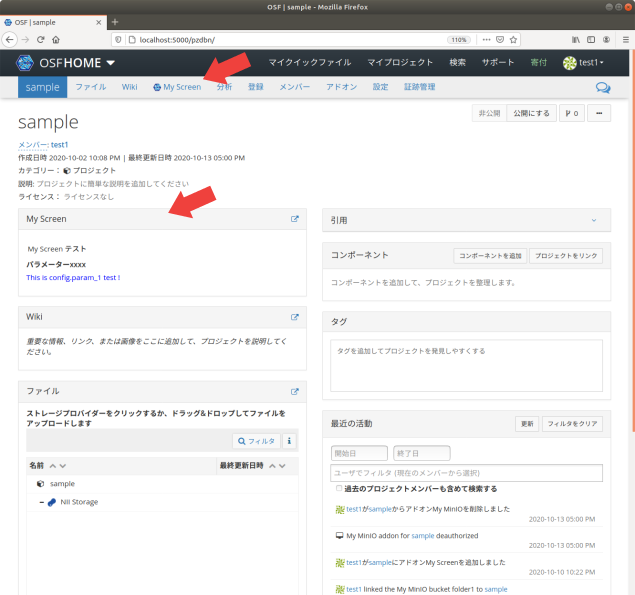
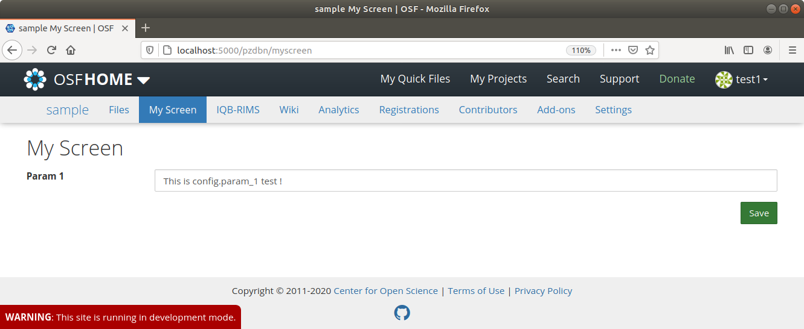

# 画面拡張アドオンの作成

以下の機能を持つ画面拡張アドオンを実装します。

- プロジェクトダッシュボード上のアドオンのウィジェッド
- プロジェクトのナビゲーションバーから遷移できるアドオンの画面タブ(Emberを利用)

基本的なアドオンの概要は[スケルトンの作成](../Skelton/README.md)を参照してください。

## 前提条件

[開発環境の準備](../Environment.md#開発環境でRDMを起動する)のガイドに従い、開発環境にてRDMを起動しているものとします。

# 画面拡張アドオンの設計

## サービスの構成

画面拡張アドオンは以下の2つの要素から構成されます。

- OSF.ioサービスで動作するAddon: ユーザ・プロジェクト設定の管理
- ember-osf-webサービスで動作する画面タブモジュール: 画面タブのView定義

ember-osf-webは、 [Ember.js](https://www.emberjs.com) をベースとしたOSFのフロントエンドUIの実装です。もともと、OSF.ioがフロントエンドも担当していましたが、COSはEmber.jsベースのコードに移行を進めています。

現在はosf-web(OSF.io)が外部からのリクエストを受け、要求されたエンドポイントをember-osf-webがサポートしていると判断される場合は、osf-webがember-osf-webに対してリクエストを転送する形式を取っています。実際のデータベースに対する操作は、従来のosf-api(OSF.io apiserver)が担います。ember-osf関連のフロントエンドは、必要に応じてAPIサーバへの問い合わせを行うことで、データベースに対する変更やストレージに対する操作を実施することができます。

## ファイルの構成

典型的なファイル配置は以下のようになります。

### OSF.io Addonのファイル構成

> クラス構成はスケルトン アドオンと同様です。

```
/addons/アドオン名/
├── __init__.py ... モジュールの定義
├── apps.py ... (**) アプリケーションの定義
├── models.py ... モデルの定義
├── requirements.txt ... 利用するPythonモジュールの定義
├── routes.py ... (**) View(Routes)の定義
├── settings ... 設定を定義するモジュール
│   ├── defaults.py ... デフォルト設定の定義
│   └── __init__.py ... 設定の定義
├── static ... Webブラウザから読み込むことを想定した静的ファイル
│   ├── comicon.png ... アドオンのアイコン
│   ├── アドオン名.css ... (*) ウィジェットのCSSファイル
│   ├── node-cfg.js ... Node設定のエントリとなるJavaScriptファイル
│   └── widget-cfg.js ... (*) ウィジェットのJavaScriptファイル
├── templates ... テンプレートディレクトリ
│   └── <アドオン名>_node_settings.mako ... Node設定パネル
├── tests ... テストコード
│   ├── __init__.py
│   ├── conftest.py
│   ├── factories.py
│   ├── test_model.py
│   ├── (**) test_view.py
│   └── utils.py
├── utils.py ... (*) ユーティリティ関数の定義
└── views.py ... (**) View(Views)の定義
```

`(*)`が付いているファイルはスケルトン アドオンには存在しないファイルです。  
`(**)`が付いているファイルはスケルトン アドオンに存在しますが、変更が加えられているファイルです。

### ember-osf-web 画面タブのファイル構成

```
app
├── guid-node/アドオン名 ... アドオンの画面タブモジュール定義
│   ├── controller.ts ... 画面タブのコントローラ定義
│   ├── route.ts ... 画面タブのルーティング定義
│   ├── styles.scss ... 画面タブのCSS(SCSS)定義
│   └── template.hbs ... 画面タブのテンプレートファイル
├── models/モデル名.ts ... 画面タブで使うモデル定義
├── adapters/モデル名.ts ... 画面タブで使うモデルのアダプタ定義
└── serializers/モデル名.ts ... 画面タブで使うモデルのシリアライザ定義

tests ... テストコード
├── acceptance/guid-node/アドオン名-test.ts
└── unit/guid-node/アドオン名/controller-test.ts

mirage ... アダプタ接続先APIのテスト用モック定義
├── factories/モデル名.ts
└── views/モデル名.ts
```

## OSF.io Addonのモジュール構成

スケルトン アドオンと大きな違いはありません。スケルトン アドオンとの違いを中心に説明していきます。

### Modelの構成

Modelの構成はスケルトン アドオンと同じです。

### Viewの構成

スケルトン アドオンのViewsおよびRoutesの定義に、画面タブ用の定義を追加します。

画面タブでアドオンのデータをやり取りするには、ember-osf-webに新しくモデルを定義し、そのモデルに対応するJSON APIをOSF.io側に定義する必要があります。  
データは以下のような [JSON:API](https://jsonapi.org/) で定められたフォーマットでやり取りします。

```
{
  "data": {
    "id": nodeのID
    "type": "モデル名",
    "attributes": データのDictionary
  }
}
```

My Screenアドオンの場合、以下のようにRoutesとViewsを定義します。

- [routes.py](osf.io/addon/routes.py)
- [views.py](osf.io/addon/views.py)

### フレームワークによって提供されるView

アドオンのウィジェット定義を追加します。

ウィジェットテンプレートは [website/templates/util/render_addon_widget.mako](https://github.com/RCOSDP/RDM-osf.io/blob/develop/website/templates/util/render_addon_widget.mako) に定義します。
ウィジェットテンプレートの設定は [website/project/views/node.py](https://github.com/RCOSDP/RDM-osf.io/blob/develop/website/project/views/node.py) に定義します。

ウィジェットで使うJavaScriptは `/addons/アドオン名/static/widget-cfg.js` で、CSSは `/addons/アドオン名/static/アドオン名.css` で定義します。CSSはJavaScriptファイルから `require()` を使って読み込みます。

My Screenアドオンの場合、以下のように定義します。

- [render_addon_widget.mako](osf.io/website/templates/util/render_addon_widget.mako)
- [node.py](osf.io/website/project/views/node.py)
- [widget-cfg.js](osf.io/addon/static/widget-cfg.js)
- [myscreen.css](osf.io/addon/static/myscreen.css)

### 国際化

国際化の設定は [website/translations/](https://github.com/RCOSDP/RDM-osf.io/blob/develop/website/translations/) 以下のファイルに、以下のように定義します。

```
msgid メッセージID
msgstr 国際化後の文字列
```

`*.pot` ファイルには `msgstr` を `""` (空文字)にして定義します。
`messages.*` にはmakoのテンプレートファイルで使う国際化設定を、 `js_messages.*` にはJavaScriptで使う国際化設定を定義します。

JavaScriptで文字列を国際化するのは、以下のように書きます。

```
var _ = require('js/rdmGettext')._;
const localizedStr = _('メッセージID');
```

makoで文字列を国際化するのは、以下のように書きます。

```
${_("メッセージID")}
```

### 設定モジュール

設定モジュールはスケルトン アドオンと同じです。

### AddonAppConfigの定義

ウィジェットと画面タブを有効にするために、 `/addons/アドオン名/app.py` の `AddonAppConfig.views` に、`'widget'` と `'page'` を追加します。

```
class AddonAppConfig(BaseAddonAppConfig):
    # 中略
    views = ['widget', 'page']
    # 中略
```

My Screenアドオンの場合、以下のように定義します。

- [apps.py](osf.io/addon/apps.py)

### テストコード

スケルトン アドオンと同様に、ユニットテストを定義します。  
My Screenアドオンの場合、以下のように定義します。

- [tests/](osf.io/addon/tests/)

## ember-osf-web 画面タブのモジュール構成

ember-osf-webは [TypeScript](https://www.typescriptlang.org) によって実装されます。  
アプリケーションのコードは [app/](https://github.com/RCOSDP/RDM-ember-osf-web/blob/master/app/) に実装されます。

ember-osf-webは、OSFの画面を構成するページを単位としてモジュール分割されています。

### router.ts
[router.ts](https://github.com/RCOSDP/RDM-ember-osf-web/blob/master/app/router.ts) は、ページ全体を束ねるルーティング定義ファイルです。

例えば、 `/プロジェクトID/アドオン名` というパスを追加する場合は、 `Router.map` に渡す関数に以下を追加します。

```
this.route('guid-node', { path: '--node/:guid' }, function() {
    this.route('アドオン名');
});
```

このパスにリクエストが与えられると、 `app/guid-node/アドオン名` で定義されたページに処理が移行します。

### ページの実装

#### 画面の実装
画面の実装は [Handlebars templating library](https://handlebarsjs.com/) を使用して、 `template.hbs` ファイルに定義します。

画面上の文字列は全て国際化を考慮し、 [translations/en-us.yml](https://github.com/RCOSDP/RDM-ember-osf-web/blob/master/translations/en-us.yml) に定義された値を埋め込む必要があります。

My Screenアドオンの場合、以下のように定義します。

- [template.hbs](ember-osf-web/app/guid-node/myscreen/template.hbs)
- [translations/en-us.yml](ember-osf-web/translations/en-us.yml)

> [ボタン](https://github.com/RCOSDP/RDM-ember-osf-web/tree/master/lib/osf-components/addon/components/osf-button) や [DatePicker](https://github.com/RCOSDP/RDM-ember-osf-web/tree/master/lib/osf-components/addon/components/validated-input/date) 、 [ダイアログボックス](https://github.com/RCOSDP/RDM-ember-osf-web/tree/master/lib/osf-components/addon/components/osf-dialog) などは、別のコンポーネントとして定義することで再利用できるようになっています。
> [lib/osf-components](https://github.com/RCOSDP/RDM-ember-osf-web/tree/master/lib/osf-components) のコードを確認して、コンポーネントを利用しましょう。

#### コントローラの定義
画面に埋め込む変数やハンドラの制御はコントローラが担います。  
コントローラには `template.hbs` に埋め込まれる変数やイベントに対する処理を記述します。

My Screenアドオンの場合、以下のように定義します。

- [controller.ts](ember-osf-web/app/guid-node/myscreen/controller.ts)

また、コントローラとバックエンドのやり取りは、Ember Dataが提供する [DS.Store](https://api.emberjs.com/ember-data/release/classes/Store) オブジェクトを経由して行われます。  
DS.Storeで操作可能なオブジェクトは [models](https://github.com/RCOSDP/RDM-ember-osf-web/tree/master/app/models) に定義され、 [adapters](https://github.com/RCOSDP/RDM-ember-osf-web/tree/master/app/adapters) に定義されたルールに基づき、APIサーバを介したオブジェクトの操作を行います。

なお、APIサーバは [JSON:API](https://jsonapi.org/) に則っていることを前提とすることで、adapterは細かなエンドポイント生成処理を定義することなく、APIサーバとの連携を実現することができます。  
エンドポイント生成処理をカスタマイズしたい場合は、 [serializers](https://github.com/RCOSDP/RDM-ember-osf-web/tree/master/app/serializers) に定義を追加します。

My Screenアドオンの場合、`myscreen-config` というmodelと、対応するadapterおよびserializerを以下のように定義します。

- [models/myscreen-config.ts](ember-osf-web/app/models/myscreen-config.ts)
- [adapters/myscreen-config.ts](ember-osf-web/app/adapters/myscreen-config.ts)
- [serializers/myscreen-config.ts](ember-osf-web/app/serializers/myscreen-config.ts)

#### スタイルの定義
スタイルは [Sass(SCSS)](https://sass-lang.com/) を使用して、 `styles.scss` ファイルに定義します。  
My Screenアドオンの場合、以下のように定義します。

- [styles.scss](ember-osf-web/app/guid-node/myscreen/styles.scss)

#### ルーティングの定義
モジュールに関する追加の経路定義を `route.ts` に定義します。  
My Screenアドオンの場合、以下のように定義します。

- [route.ts](ember-osf-web/app/guid-node/myscreen/route.ts)

### テストコード

テストコードは [tests/](https://github.com/RCOSDP/RDM-ember-osf-web/tree/master/tests/) に定義します。
テストに使うAPIのモックは、 [Mirage](https://miragejs.com/) を使用して [mirage/](https://github.com/RCOSDP/RDM-ember-osf-web/tree/master/mirage/) に定義します。

My Screenアドオンの場合、以下のように定義します。

- [tests/](ember-osf-web/tests)
- [mirage/](ember-osf-web/mirage)


# My Screenアドオンの実装

ここでは、 `myscreen` という識別名のアドオンの実装を例に説明します。アドオンの完全名は `My Screen` とします。

アドオン名は様々な場所に埋め込まれています。アドオン名を変更したい場合は、以降で追加・変更するファイル名やコードの `myscreen` 、 `My Screen` 、 `MyScreen` という文字列を変更してください。

## OSF.ioへの実装

### addons.myscreen モジュールの定義

スケルトン アドオンと同様に、[アドオンの実装例(`osf.io/addon/`)](osf.io/addon/)を `addons/myscreen` ディレクトリにコピーします。

### RDMコードの変更

スケルトン アドオンと同様に、RDMのコードをいくつか変更します。

- [addons.json](https://github.com/RCOSDP/RDM-osf.io/blob/develop/addons.json)
  - 変更例のサンプル: [addons.json](osf.io/config/addons.json)
- [framework/addons/data/addons.json](https://github.com/RCOSDP/RDM-osf.io/blob/develop/framework/addons/data/addons.json)
  - 変更例のサンプル: [addons.json](osf.io/config/framework/addons/data/addons.json)
- [Dockerfile](https://github.com/RCOSDP/RDM-osf.io/blob/develop/Dockerfile)
  - 変更例のサンプル: [Dockerfile](osf.io/config/Dockerfile)
- [api/base/settings/defaults.py](https://github.com/RCOSDP/RDM-osf.io/blob/develop/api/base/settings/defaults.py)
  - 変更例のサンプル: [defaults.py](osf.io/config/api/base/settings/defaults.py)
  
#### ウィジェットテンプレートの変更

[website/templates/util/render_addon_widget.mako](https://github.com/RCOSDP/RDM-osf.io/blob/develop/website/templates/util/render_addon_widget.mako) に、ウィジェットのテンプレート定義を追加します。

```
% if addon_name == 'myscreen':
    <div id="myscreen-content" class="scripted">
        <!-- ko if: loading -->
        <div>${_("Loading")}</div>
        <!-- /ko -->
        <!-- ko if: loadFailed -->
        <div class="text-danger">${_("Error occurred")}</div>
        <!-- /ko -->
        <!-- ko if: loadCompleted -->
        <h5 style="padding: 0.2em;">${_("My Screen Test")}</h5>
        <div>
            <label data-bind="text: param_1_label"></label>
            <p data-bind="text: param_1"></p>
        </div>
        <!-- /ko -->
    </div>
% endif
```

[website/project/views/node.py](https://github.com/RCOSDP/RDM-osf.io/blob/develop/website/project/views/node.py) の `view_project()` 関数に、My Screenアドオンのウィジェットデータを読み込むコードを追加します。

```
def view_project(auth, node, **kwargs):
    # 中略
    addons_widget_data = {
        # 中略
        'myscreen': None
    }

    if 'myscreen' in ret['addons']:
        addons_widget_data['myscreen'] = serialize_myscreen_widget(node)
    # 中略
```

それぞれの変更例は、サンプル [render_addon_widget.mako](osf.io/website/templates/util/render_addon_widget.mako) と [node.py](osf.io/website/project/views/node.py) を参照してください。

#### 国際化ファイルの変更

[website/translations/](https://github.com/RCOSDP/RDM-osf.io/blob/develop/website/translations/) 以下の各国際化ファイルに、アドオンで表示する文字列の国際化設定を追加します。

`website/translations/messages.pot` と `website/translations/en/LC_MESSAGES/messages.po`:

```
#: website/templates/util/render_addon_widget.mako:245
msgid "My Screen Test"
msgstr ""
```

`website/translations/ja/LC_MESSAGES/messages.po`:

```
#: website/templates/util/render_addon_widget.mako:245
msgid "My Screen Test"
msgstr "My Screen テスト"
```

`website/translations/js_messages.pot` と `website/translations/en/LC_MESSAGES/js_messages.po`:

```
#: addons/myscreen/static/widget-cfg.js:22
msgid "My Screen Param1 Label"
msgstr ""
```

`website/translations/ja/LC_MESSAGES/js_messages.po`:

```
#: addons/myscreen/static/widget-cfg.js:22
msgid "My Screen Param1 Label"
msgstr "パラメーター1"
```

変更例は、サンプル [translations/](osf.io/website/translations/) を参照してください。

### Migrationsファイルの作成

`makemigrations` コマンドを実行して、Migrationsファイルを作成します。

```
$ docker-compose run --rm web python3 manage.py makemigrations
```

上記の出力中に以下のような出力が現れれば成功です。

```
Migrations for 'addons_myscreen':
  addons/myscreen/migrations/0001_initial.py
    - Create model NodeSettings
    - Add field user_settings to nodesettings
```

### Widgetの表示位置のカスタマイズ

デフォルトでは、アドオンのWidgetはダッシュボードの左カラムの下部(FileViewerの下)に、アドオンの名前順で表示されます。表示位置を変更する場合は、 [website/templates/project/project.mako](https://github.com/RCOSDP/RDM-osf.io/blob/develop/website/templates/project/project.mako) ファイルを編集します。

> 今後、プロジェクトダッシュボードの表示もEmber化されることが考えられます。その場合は、Ember側も合わせて変更する必要があります。

左カラムの一番上(Wikiウィジェットの上)に表示したい場合は、以下のように修正します。

```diff
@@ -431,6 +431,10 @@

     <div class="col-sm-12 col-md-6 osf-dash-col">
 
+        % if 'myscreen' in addons_enabled and addons['myscreen']['has_widget']:
+            ${ render_addon_widget.render_addon_widget('myscreen', addons_widget_data['myscreen']) }
+        % endif
+
         %if user['show_wiki_widget']:
             ${ render_addon_widget.render_addon_widget('wiki', addons_widget_data['wiki']) }
         %endif
@@ -470,7 +474,7 @@
             <!-- Show widgets in left column if present -->
             % for addon in addons_enabled:
                 % if addons[addon]['has_widget']:
-                    %if addon != 'wiki' and addon != 'iqbrims': ## We already show the wiki widget at the top
+                    %if addon != 'wiki' and addon != 'iqbrims' and addon != 'myscreen': ## We already show the wiki widget at the top
                         ${ render_addon_widget.render_addon_widget(addon, addons_widget_data[addon]) }
                     %endif
                 % endif
```

右カラムの一番上に表示したい場合は、以下のように修正します。

```diff
@@ -470,7 +470,7 @@
             <!-- Show widgets in left column if present -->
             % for addon in addons_enabled:
                 % if addons[addon]['has_widget']:
-                    %if addon != 'wiki' and addon != 'iqbrims': ## We already show the wiki widget at the top
+                    %if addon != 'wiki' and addon != 'iqbrims' and addon != 'myscreen': ## We already show the wiki widget at the top
                         ${ render_addon_widget.render_addon_widget(addon, addons_widget_data[addon]) }
                     %endif
                 % endif
             % endfor
         % else:
             <!-- If no widgets, show components -->
             ${children()}
         % endif
 
     </div>
 
     <div class="col-sm-12 col-md-6 osf-dash-col">
+        % if 'myscreen' in addons_enabled and addons['myscreen']['has_widget']:
+            ${ render_addon_widget.render_addon_widget('myscreen', addons_widget_data['myscreen']) }
+        % endif
+
         % if addons:
             <!-- Show IQB-RIMS widgets in right column if present -->
             % for addon in addons_enabled:
```

変更例は、サンプル [project.mako](osf.io/website/templates/project/project.mako) を参照してください。

### 画面タブリンクの表示位置のカスタマイズ

デフォルトでは、アドオン画面タブのリンクはナビゲーションバーのFiles(ファイル)タブの右に、アドオンの名前順で表示されます。表示位置を変更する場合は、[website/templates/project/project_header.mako](https://github.com/RCOSDP/RDM-osf.io/blob/develop/website/templates/project/project_header.mako) ファイルを編集します。

> アドオン画面タブなどのember-osf-webが提供するViewを開いているときは、ember-osf-webで定義した `node-navbar` コンポーネントのテンプレート(後述)に従って表示されます。

アドオンリストの最後（Analytics（分析）の前）に表示する場合は、以下のように修正します。

```diff
@@ -43,7 +43,7 @@
                         <!-- Add-on tabs  -->
                         % for addon in addons_enabled:
 
-                            % if addons[addon]['has_page']:
+                            % if addon != 'myscreen' and addons[addon]['has_page']:
                                 <li>
                                     <a href="${node['url']}${addons[addon]['short_name']}">
 
                                         % if addons[addon]['icon'] and addons[addon]['has_page_icon']:
                                             
                                         % endif
                                         ${addons[addon]['full_name']}
                                     </a>
                                 </li>
                             % endif
                         % endfor
 
+                        % if 'myscreen' in addons_enabled and addons['myscreen']['has_page']:
+                            <li>
+                                <a href="${node['url']}${addons['myscreen']['short_name']}">
+
+                                    % if addons['myscreen']['icon'] and addons['myscreen']['has_page_icon']:
+                                        
+                                    % endif
+                                    ${addons['myscreen']['full_name']}
+                                </a>
+                            </li>
+                        % endif
+
                         % if project_analytics:
                         % if node['is_public'] or user['is_contributor_or_group_member']:
                             <li><a href="${node['url']}analytics/">${ _("Analytics") }</a></li>
```

変更例は、サンプル [project_header.mako](osf.io/website/templates/project/project_header.mako) を参照してください。

### アドオンのテスト

以下のコマンドで、OSF.ioに追加したMy Screenアドオンのユニットテストを実行できます。

```
$ docker-compose run --rm web invoke test_module -m addons/myscreen/tests/
```

## ember-osf-webへの実装

### 画面タブの実装

[画面タブの実装例(`ember-osf-web/app/guid-node/myscreen/`)](ember-osf-web/app/guid-node/myscreen/) を `app/guid-node/myscreen` ディレクトリにコピーします。

### myscreen-config モデルの定義

My Screenアドオンの画面タブでは、NodeSettingsの `param_1` プロパティに対応する `param1` プロパティを持つ、 `MyScreenConfig` モデルを定義して扱います。`MyScreenConfig` モデルと、アダプタ、シリアライザを、それぞれ以下のようにコピーします。

- [MyScreenConfigモデルの実装例](ember-osf-web/app/models/myscreen-config.ts) を `app/models/myscreen-config.ts` にコピーします。
- [MyScreenConfigアダプタの実装例](ember-osf-web/app/adapters/myscreen-config.ts) を `app/adapters/myscreen-config.ts` にコピーします。
- [MyScreenConfigシリアライザの実装例](ember-osf-web/app/serializers/myscreen-config.ts) を `app/serializers/myscreen-config.ts` にコピーします。

### テストコードの定義

画面タブに関するテストコード例と、テストに利用するMirageのコード例を、それぞれ以下のようにコピーします。

- [画面タブのコントローラの単体テストのコード例](ember-osf-web/tests/acceptance/guid-node/myscreen-test.ts) を `tests/acceptance/guid-node/myscreen-test.ts` にコピーします。
- [画面タブの受け入れテストのコード例](ember-osf-web/tests/unit/guid-node/myscreen/controller-test.ts) を `tests/unit/guid-node/myscreen/controller-test.ts` にコピーします。
- [MyScreenConfigのMirage Factoryコード例](ember-osf-web/mirage/factories/myscreen-config.ts) を `mirage/factories/myscreen-config.ts` にコピーします。
- [MyScreenConfigのMirage Viewsコード例](ember-osf-web/mirage/views/myscreen-config.ts) を `mirage/views/myscreen-config.ts` にコピーします。

### RDMコードの変更

#### ルーティングの設定

[app/router.ts](https://github.com/RCOSDP/RDM-ember-osf-web/blob/develop/app/router.ts) に、アドオンの画面タブページへのルーティング設定を追加します。

```
this.route('guid-node', { path: '--node/:guid' }, function() {
    this.mount('analytics-page', { as: 'analytics' });
    this.route('forks');
    this.route('iqbrims');
    this.route('myscreen');  // 追加
    this.route('registrations');
    this.route('drafts', { path: '/drafts/:draftId' }, function() {
        this.route('register');
    });
});
```

変更例は、サンプル [router.ts](ember-osf-web/app/router.ts) を参照してください。

#### ナビゲーションバー定義の変更

ember-osf-webが提供するViewから見えるプロジェクトのナビゲーションバーで、画面タブのリンクを表示するために、テンプレートファイル [lib/osf-components/addon/components/node-navbar/template.hbs](https://github.com/RCOSDP/RDM-ember-osf-web/blob/develop/lib/osf-components/addon/components/node-navbar/template.hbs) にコードを追加します。

```
{{#if this.myscreenEnabled }}
    {{node-navbar/link node=@node useLinkTo=false destination='myscreen'}}
{{/if}}
```

RDMでMy Screenアドオンが有効でないときはリンクを表示しないようにするために、コンポーネント定義ファイル [lib/osf-components/addon/components/node-navbar/component.ts](https://github.com/RCOSDP/RDM-ember-osf-web/blob/develop/lib/osf-components/addon/components/node-navbar/component.ts) に `myscreenEnabled` プロパティを追加します。

```
@computed('node.addons.[]')
get myscreenEnabled(): Promise<boolean> | null {
    if (!this.node) {
        return null;
    }
    const node = this.node;
    return (async () => {
        const addons = await node.addons;
        if (!addons) {
            return false;
        }
        const myscreen = addons.filter(addon => addon.id === 'myscreen');
        return myscreen.length > 0;
    })();
}
```

ナビゲーションバーのテスト [tests/integration/components/node-navbar/component-test.ts](https://github.com/RCOSDP/RDM-ember-osf-web/blob/develop/tests/integration/components/node-navbar/component-test.ts) も修正します。

それぞれの変更例は、サンプル [template.hbs](ember-osf-web/lib/osf-components/addon/components/node-navbar/template.hbs) 、 [component.ts](ember-osf-web/lib/osf-components/addon/components/node-navbar/component.ts) 、 [component-test.ts](ember-osf-web/tests/integration/components/node-navbar/component-test.ts) を参照してください。

#### 国際化ファイルの変更

[translations/en-us.yml](https://github.com/RCOSDP/RDM-ember-osf-web/blob/develop/translations/en-us.yml) に、My Screenアドオンの画面タブで表示する文字列の国際化設定を追加します。

```
myscreen:
  page_title: '{nodeTitle} My Screen'
  header: 'My Screen'
  loading: 'Loading My Screen config...'
  param1: 'Param 1'
  save_button: 'Save'
  failed_to_submit: 'Failed to save'
  placeholders:
      param1: 'anything'
```

変更例は、サンプル [en-us.yml](ember-osf-web/translations/en-us.yml) を参照してください。

#### Mirage定義の変更

追加したMirageコードを利用してAPIをモックするように、 [mirage/config.ts](https://github.com/RCOSDP/RDM-ember-osf-web/blob/develop/mirage/config.ts) に以下を追加します。

```
this.get('/project/:id/myscreen/config', myscreenConfig);
```

変更例は、サンプル [config.ts](ember-osf-web/mirage/config.ts) を参照してください。

### docker-compose.override.yml の追加

変更したコードを使うように、RDMの `docker-compose.override.yml` で osf-ember-web サービスの `volumes` を指定します。

例えば、以下のようなディレクトリ階層の場合は、

```
.
├── RDM-osf.io
│   ├── docker-compose.override.yml
│   └── docker-compose.yml
└── RDM-ember-osf-web
```

`RDM-osf.io/docker-compose.override.yml` の内容を以下のようにします。

```
version: "3.4"

services:
  ember_osf_web:
    volumes:
      - ../RDM-ember-osf-web:/code
```

### 画面タブのテスト

以下のコマンドで、ember-osf-webに追加したMy Screen 画面タブのテストを実行できます。

コントローラの単体テスト:

```
$ docker-compose run --rm ember_osf_web yarn test --module 'Unit | Controller | guid-node/myscreen'
```

ナビゲーションバーの結合テスト:

```
$ docker-compose run --rm ember_osf_web yarn test --module 'Integration | Component | node-navbar'
```

画面タブの受け入れテスト:

```
$ docker-compose run --rm ember_osf_web yarn test --module 'Acceptance | guid-node/myscreen'
```

ファイルを指定してlintを実行するのは、以下のコマンドを実行します。

```
$ docker-compose run --rm ember_osf_web node_modules/.bin/eslint --ext js,ts --max-warnings=0 'app/guid-node/myscreen' 'app/**/myscreen-config.ts' 'app/router.ts' 'lib/osf-components/addon/components/node-navbar/component.ts' 'tests/integration/components/node-navbar/component-test.ts' 'mirage/config.ts'
$ docker-compose run --rm ember_osf_web node_modules/.bin/tslint -p . 'app/guid-node/myscreen/**/*.ts' 'app/**/myscreen-config.ts' 'app/router.ts' 'lib/osf-components/addon/components/node-navbar/component.ts' 'tests/integration/components/node-navbar/component-test.ts' 'mirage/config.ts'
$ docker-compose run --rm ember_osf_web node_modules/.bin/stylelint 'app/guid-node/myscreen/**/*.scss'
$ docker-compose run --rm ember_osf_web node_modules/.bin/ember-template-lint 'app/guid-node/myscreen/**/*.hbs' 'lib/osf-components/addon/components/node-navbar/template.hbs'
```


# My Screenアドオンの動作確認

My Screenアドオンの動作確認をしてみましょう。

## DBマイグレーション

マイグレーションを実行し、Migrations定義をPostgreSQLサービスに反映します。

```
$ docker-compose run --rm web python3 manage.py migrate
```

## 国際化のコンパイル

`.mako` ファイルの国際化設定を適用するために、国際化ファイルをコンパイルします。

```
$ docker-compose run --rm web pybabel compile -d ./website/translations
```

> `.js` ファイルの国際化設定は、 `assets` サービスの再起動時に適用されます。

## サービスの再起動

変更したファイルに関連するサービスを再起動します。

```
$ docker-compose restart assets web api ember_osf_web
```

これでサービスへの反映は完了です。

## ストレージアドオンを試す

My Screenアドオンの有効化手順は、スケルトン アドオンと同様です。
My Screenアドオンを有効化すると、プロジェクトダッシュボードにウィジェットが表示され、ナビゲーションバーに画面タブのリンクが表示されます。



画面タブのリンクをクリックすると、画面タブのページを表示できます。



ここで設定した `param_1` プロパティの値が、ウィジェットに表示されます。

以上でMy Screenアドオンの動作確認は完了です！
