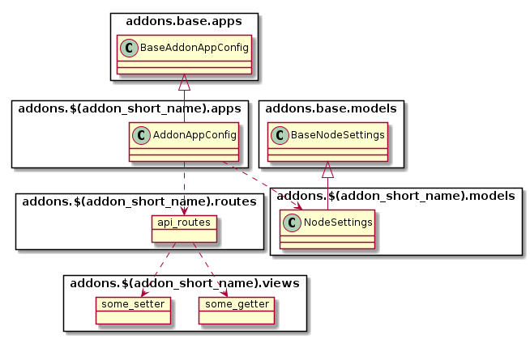
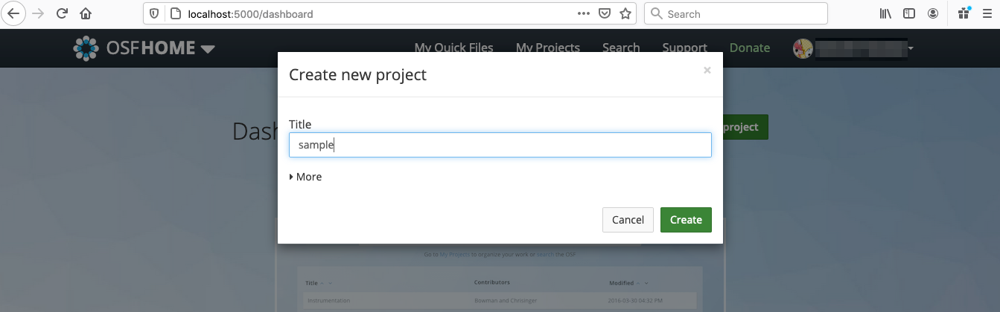
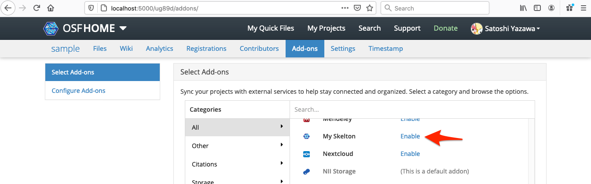
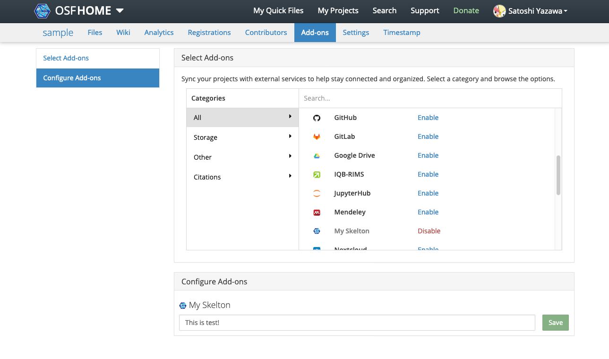

# スケルトンの作成

アドオン開発の第一歩として、以下のような単純な機能を持つ「スケルトン」アドオンを実装します。

スケルトンは以下の機能を持つものとします。

- 任意のプロジェクトにてスケルトンを有効化可能
- スケルトンは `param_1` というパラメータを持ち、プロジェクトごとに異なる値を設定することができる
- `param_1` パラメータはプロジェクトのアドオン設定画面で設定することができる

## 前提条件

[開発環境の準備](../Environment.md#開発環境でRDMを起動する)のガイドに従い、開発環境にてRDMを起動しているものとします。

# RDMアドオンの設計

## ファイルの構成

RDMにおいてアドオンは[Django](https://www.djangoproject.com/)アプリケーションの形式で記述されます。以下のようなファイルおよびクラスから構成されます。



典型的なファイル配置は以下のようになります。

```
/addons/アドオン名/
├── __init__.py ... モジュールの定義
├── apps.py ... アプリケーションの定義
├── models.py ... モデルの定義
├── requirements.txt ... 利用するPythonモジュールの定義
├── routes.py ... View(Routes)の定義
├── settings ... 設定を定義するモジュール。ここにlocal.pyを配置することでカスタマイズできる。
│   ├── defaults.py ... デフォルト設定の定義
│   └── __init__.py ... 設定の定義
├── static ... Webブラウザから読み込むことを想定した静的ファイル
│   ├── comicon.png ... アドオンのアイコン
│   └── node-cfg.js ... Node設定を定義するJavaScriptファイル
├── templates ... テンプレートディレクトリ
│   └── node_settings.mako ... Node設定パネル
├── tests ... テストコード
│   ├── conftest.py
│   ├── factories.py
│   ├── test_model.py
│   ├── test_view.py
│   └── utils.py
└── views.py ... View(Views)の定義
```

## アドオンのモジュール構成

アドオンはDjangoの作法に従い、Model-Viewアーキテクチャにより実装します。それぞれの責務は以下のように分担されます。

- Model ... ユーザとNode(プロジェクト)それぞれに対応したモデルを実装する。それぞれのモデルには認証情報やプロジェクト固有の情報を格納することができる
- View ... アドオンに応じた設定、データ取得、保存処理など、HTTP上のエンドポイント(パス)を定義する

Modelはフレームワークにより自動的にそれぞれの利用者、プロジェクトに対応して生成、管理され、永続化されるのに対し、Viewはアプリケーションがロードされる際に構築されます。
フレームワークによりそれぞれのライフサイクルが適切に管理されるので、アドオン開発者は機能面の実装に注力することができます。

### Modelの構成

Node(プロジェクト)に関する情報や、ユーザごとの情報(認証情報等)を記録、管理したい場合、Modelを定義します。

UserSettingsは利用者ごとにインスタンスが生成され、永続化されます。また、NodeSettingsはプロジェクトごとにインスタンスが生成、永続化されます。これらのインスタンスの生成や破棄をアドオンのコードが行うことは原則としてありません。

スケルトンの場合、以下のようにNodeに関するModelを定義します。

- [addons.myskelton.NodeSettings](addon/models.py)

NodeSettingsは永続化すべきプロパティと、各種setterとgetterを定義しています。

### Viewの構成

Viewは[FlaskのPluggable Views](http://flask.pocoo.org/docs/0.10/views/)のように、サービス上のパスと処理の関係を定義します。定義はRoutesとViewsの2種類の要素から構成されます。

- Routes ... View処理をどのパスにマッピングし、どのような形式で出力するか。出力にはJSON形式や、HTMLのテンプレートを指定することができる
- Views ... View処理の内容

Routesは以下のようにパスとMethod(GET, POST, PUT, DELETE, ...)と、その組み合わせに対してどの関数を実行するか、その実行結果をどのように出力するかを定義します。

各View処理には、その処理の実行における前提をPythonのデコレータの形で記述することができます。指定可能なデコレータには以下のようなものがあります。

- `framework.auth.decorators.must_be_logged_in` ... ユーザがログインしている状態である場合にのみ呼び出し可能であることを宣言する。引数にはauthパラメータが追加され、認証しているユーザに関する情報を得ることができる
- `website.project.decorators.must_have_addon` ... アドオンに関する情報を必要とすることを宣言する。第1引数にはアドオン名を(例では `myskelton`)、第2引数には'user'か'node'のいずれかを定義する。('node'にした場合は、パスは /project/<pid>/ から始める必要がある)
- `website.project.decorators.must_have_permission` ... 必要なパーミッションを宣言する。引数には'write', 'read', 'admin'のいずれかを指定する。


スケルトンの場合、以下のようにRoutesとViewsを定義します。

- [api_routes](addon/routes.py)
- [myskelton_get_config, myskelton_set_config](addon/views.py)

コンテキストに応じてデコレータを宣言しておくことで、Viewの処理の中でModel(利用者が操作対象としているUserやNode)を参照することができます。

### フレームワークによって提供されるView

Routes, Viewsを使うことでさまざまなAPIやインタフェースを定義することができますが、アドオンが持つ利用者用設定画面(認証情報の入力画面)とプロジェクト用設定画面(プロジェクトでアドオンを有効化した場合の設定画面)はフレームワークによってあらかじめテンプレート化されています。

- [node_settings.mako](addon/templates/node_settings.mako)


このファイルは、テンプレート言語 [mako](https://www.makotemplates.org/) で記述されます。

テンプレートを動的に操作するためのJavaScriptのライブラリにはKnockout.jsを利用することができます。JavaScriptコードについては、アドオンのstaticディレクトリにて定義することができます。

- [node-cfg.js](addon/static/node-cfg.js)

また、staticディレクトリにはアドオンのアイコンを定義する必要があります。

- [comicon.png](addon/static/comicon.png)

### 設定モジュール

アドオンの動作を環境によりカスタマイズ可能にするため、settingsモジュールを用意します。

- [settings](addon/settings/)

[RDMのアプリケーション設定](../Environment.md#基本的な流れ)と同様に、settingsディレクトリ内に `local.py` ファイルを定義することで、アドオンの動作をカスタマイズできるようになります。
設定値は `defaults.py` で定義します。スケルトンの場合、以下のように定義します。

- [defaults.py](addon/settings/defaults.py)

### テストコード

アドオンのユニットテストを定義します。スケルトンの場合、以下のようにModelのテスト(`test_model.py`)とViewのテスト(`test_view.py`)を定義しています。

- [tests](addon/tests)

### Migrations定義

Migrationsファイルは、Modelの内容をRDBのテーブルに対応づけをするために使用します。Modelの内容はバージョンによって変化しますから、各バージョンごとに適切にテーブルの変更がなされるよう、Migrationsファイルを適切に定義する必要があります。
スケルトンの場合、空の `__init__.py` を定義しています。

- [migrations](addon/migrations/)

[Migrationsファイルの作成](#Migrationsファイルの作成)にて作成方法を説明します。

# スケルトン アドオンの実装

ここでは、 `myskelton` という識別名のアドオンの実装を例に説明します。

## addons.myskelton モジュールの定義

[スケルトンコードの例](addon/)を `addons/myskelton` ディレクトリにコピーします。[ファイルの構成](#ファイルの構成)で示したツリー構造となるようにコピーしてください。

このスケルトンでは、アドオン名(識別名)を`myskelton`としています。
識別名はモジュール名と一致させる必要がありますので、`myskelton`以外の名前にしたい場合は、`addons/(識別名)` ディレクトリに[スケルトンコード](addon/)を配置するようにしてください。

また、この名前を変更したい場合は、以下のコードを変更する必要があります。

- [SHORT_NAME(Python)](addon/__init__.py)
- [SHORT_NAME(JavaScript)](addon/static/node-cfg.js)
- [view関数のプレフィックス(myskelton_*)](addon/views.py) - [参照元](addon/routes.py)

また、アドオンの完全名を `My Skelton` としています。これは、Web UIでの表示等に使われます。この名前を変更したい場合は、以下のコードを変更する必要があります。

- [AddonAppConfig.full_name](addon/apps.py)

## RDMコードの変更

追加したアドオンをRDMに認識させるために、RDMのコードをいくつか変更します。

### addons.json の変更

[addons.json](https://github.com/RCOSDP/RDM-osf.io/blob/develop/addons.json) に、アドオンに関する情報を追加します。このファイルはJSONファイル形式であり、キーごとに以下の値を登録します。

変更例はサンプル [addons.json](config/addons.json) を参照してください。

- `addons` ... 利用可能なアドオン一覧。必ず登録する
- `addons_default` ... プロジェクト作成時にデフォルトで有効になるアドオン一覧
- `addons_archivable` ... アドオンごとのアーカイブに関する情報
- `addons_commentable` ... コメント可能なアドオン一覧
- `addons_description` ... アドオン名と説明の定義

  ```
  "myskelton": "My Skelton Addon is ..."
  ```

- `addons_url` ... アドオンの関連URLの定義

  ```
  "myskelton": "https://dummy.nii.ac.jp/myskelton"
  ```

### framework/addons/data/addons.json の変更

[framework/addons/data/addons.json](https://github.com/RCOSDP/RDM-osf.io/blob/develop/framework/addons/data/addons.json) に、アドオン登録時のメッセージリソースを登録します。
`addons` オブジェクトに、アドオンの完全名(`AddonAppConfig.full_name` に相当)をキーとして情報を登録します。

変更例はサンプル [addons.json](config/framework/addons/data/addons.json) を参照してください。

```
"My Skelton": {
    "Permissions": {
        "status": "none",
        "text": "The GakuNin RDM does not affect the permissions of My Skelton."
    },
    "View / download file versions": {
        "status": "none",
        "text": "The My Skelton add-on does not provide Storage Features."
    },
    "Add / update files": {
        "status": "none",
        "text": "The My Skelton add-on does not provide Storage Features."
    },
    "Delete files": {
        "status": "none",
        "text": "The My Skelton add-on does not provide Storage Features."
    },
    "Logs": {
        "status": "none",
        "text": "The My Skelton add-on does not provide Storage Features."
    },
    "Forking": {
        "status": "partial",
        "text": "Forking a project or component copies information about linked My Skelton but the GakuNin RDM does not affect authentication of My Skelton."
    },
    "Registering": {
        "status": "none",
        "text": "My Skelton information will not be registered."
    }
}
```

### Dockerfile の変更

[Dockerfile](https://github.com/RCOSDP/RDM-osf.io/blob/develop/Dockerfile) に、アドオン関連のファイルコピー定義を追加します。

変更例はサンプル [Dockerfile](config/Dockerfile) を参照してください。


- requirements.txtのコピー
  ```
  COPY ./addons/myskelton/requirements.txt ./addons/myskelton/
  ```

- staticディレクトリの変更
  ```
  COPY ./addons/myskelton/static/ ./addons/myskelton/static/
  ```

### api/base/settings/defaults.py への追加

[api/base/settings/defaults.py](https://github.com/RCOSDP/RDM-osf.io/blob/develop/api/base/settings/defaults.py) の `INSTALLED_APPS` にアドオン名を追加します。

変更例はサンプル [defaults.py](config/api/base/settings/defaults.py) を参照してください。

```
'addons.myskelton',
```

## Migrationsファイルの作成

Modelで定義したプロパティがRDBに保存されるよう、`makemigrations`コマンドを実行します。このコマンドを実行すると、 `addons/myskelton/migrations` にPythonファイルが作成されます。

```
$ docker-compose run --rm web python3 manage.py makemigrations
```

上記の出力中に以下の出力が現れれば成功です。現れない場合、RDMがアドオンを認識していない可能性があります。特に`addons.json`, `api/base/settings/defaults.py`の設定が漏れていないかどうかを確認してください。

```
Migrations for 'addons_myskelton':
  addons/myskelton/migrations/0001_initial.py
    - Create model NodeSettings
```

## スケルトンのテスト

これでアドオンのコードの作成は完了です。以下のコマンドで追加した `addons/myskelton` のユニットテストを実行してみましょう。

```
$ docker-compose run --rm web invoke test_module -m addons/myskelton/tests/
```

# スケルトン アドオンの動作確認

スケルトン アドオンを動作確認をしてみましょう。
アドオンには新規に定義されたModelが含まれていますので、Migrations定義をサービス中のPostgreSQLサービスに反映しましょう。

```
$ docker-compose run --rm web python3 manage.py migrate
```

また、新規にJavaScriptファイルを追加したので、新たなファイルがロード対象となるように、`RDM-osf.io`をイメージとしたサービスの再起動を実施します。

```
$ docker-compose restart assets web api
```

これでサービスへの反映は完了です。スケルトン アドオンを試すには、以下のような操作を実施します。

1. RDM Web UIにアクセスする `http://localhost:5000`
1. 適当なプロジェクトを作成する
  

1. Add-onsページを開く
1. My Skeltonアドオンを有効化する
  

これで、`node_settings.mako`で定義したNode設定画面が現れます。テキストボックスに入力した値が `param_1` プロパティに反映される様子が確認できるはずです。



以上でスケルトンアドオンの動作確認は完了です！
