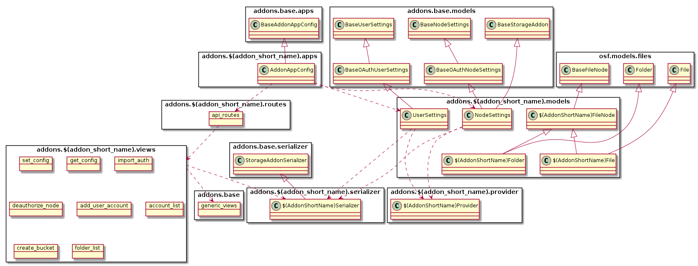
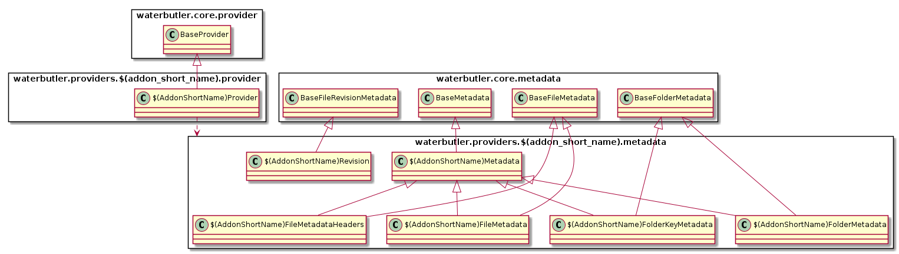
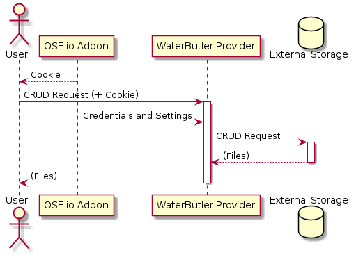
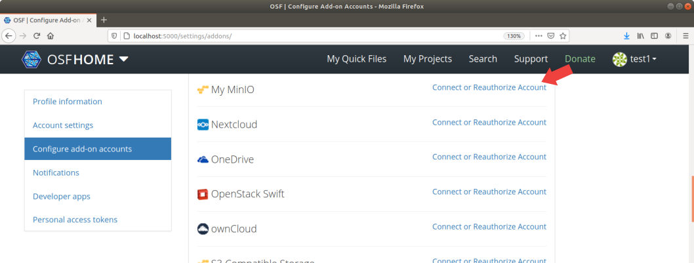
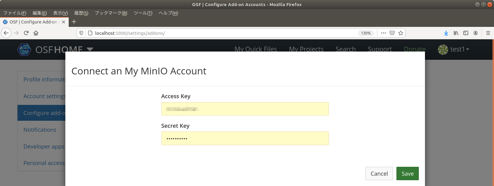
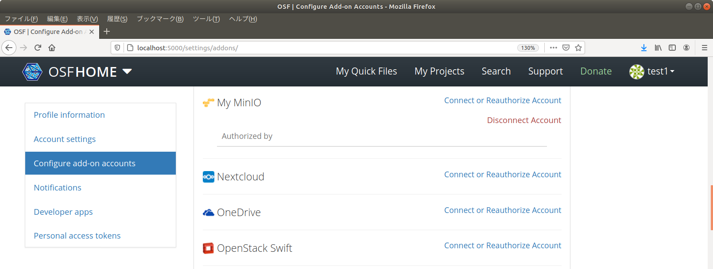
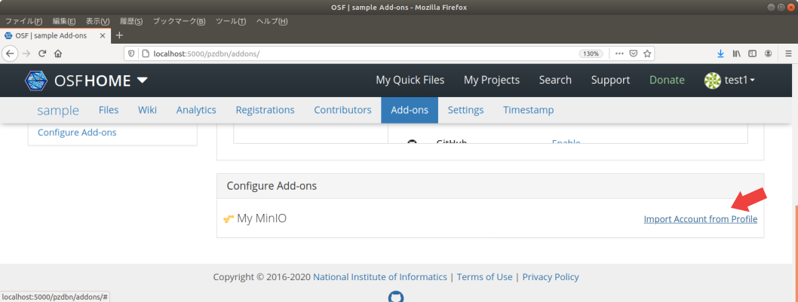
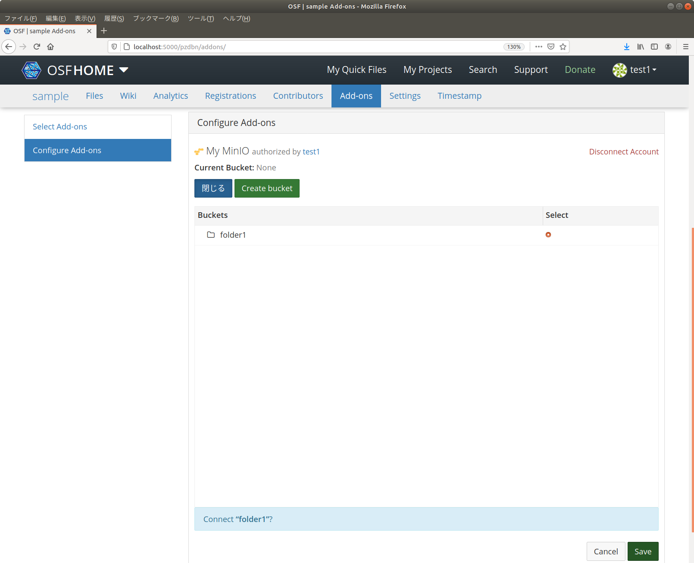
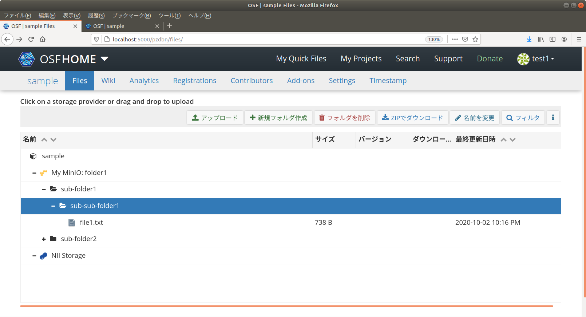

# ストレージアドオンの作成

具体的なストレージアドオンの例として、AWS S3互換の[MinIO](https://min.io/)と接続するストレージアドオンを実装します。このアドオンは特定のMinIOサーバーと接続するものとし、 My MinIOアドオンと名付けることとします。

基本的なアドオンの概要は[スケルトンの作成](../Skelton/README.md)を参照してください。

## 前提条件

[開発環境の準備](../Environment.md#開発環境でRDMを起動する)のガイドに従い、開発環境にてRDMを起動しているものとします。

# ストレージアドオンの設計

## サービスの構成

ストレージアドオンは以下の2つの要素から構成されます。

- OSF.ioサービスで動作するAddon: ユーザ・プロジェクト設定の管理
- WaterButlerサービスで動作するProvider: ストレージへのアクセスの仲介

Addonによりユーザからの認証情報の受領や各種設定を行い、Providerはこの認証情報・設定情報をAddonから譲渡してもらい、実際のストレージへのアクセスを行います。

## ファイルの構成

典型的なクラス構成とファイル配置は以下のようになります。

### OSF.io Addonのクラス構成とファイル構成



`(*)`が付いているファイルはスケルトン アドオンには存在しないファイルです。

```
/addons/アドオン名/
├── __init__.py ... モジュールの定義
├── apps.py ... アプリケーションの定義
├── models.py ... モデルの定義
├── provider.py ... (*) 認証プロバイダの定義
├── requirements.txt ... 利用するPythonモジュールの定義
├── routes.py ... View(Routes)の定義
├── serializer.py ... (*) モデル-ビュー(JavaScript)間の情報交換用シリアライザの定義
├── settings ... 設定を定義するモジュール
│   ├── defaults.py ... デフォルト設定の定義
│   ├── __init__.py ... 設定の定義
│   └── local-dist.py ... (*) local.pyのサンプルファイル
├── static ... Webブラウザから読み込むことを想定した静的ファイル
│   ├── comicon.png ... アドオンのアイコン
│   ├── myminioAnonymousLogActionList.json ... (*) 変更履歴メッセージ定義 
│   ├── myminioLogActionList.json ... (*) 変更履歴メッセージ定義
│   ├── myminioNodeConfig.js ... (*) Node設定の定義
│   ├── myminioUserConfig.js ... (*) User設定の定義
│   ├── node-cfg.js ... Node設定のエントリとなるJavaScriptファイル
│   └── user-cfg.js ... (*) User設定のエントリとなるJavaScriptファイル
├── templates ... テンプレートディレクトリ
│   ├── credentials_modal.mako ... (*) 認証情報の設定用ダイアログ
│   ├── node_settings.mako ... Node設定パネル
│   └── user_settings.mako ... (*) User設定パネル
├── tests ... テストコード
│   ├── __init__.py
│   ├── conftest.py
│   ├── factories.py
│   ├── test_model.py
│   ├── test_serializer.py ... (*)
│   ├── test_view.py
│   └── utils.py
├── utils.py ... (*) ユーティリティ関数の定義
└── views.py ... View(Views)の定義
```

### WaterButler Providerのクラス構成とファイル構成



```
waterbutler/providers/アドオン名/
├── __init__.py ... Providerクラスの参照
├── metadata.py ... Metadataの定義
├── provider.py ... Providerの定義
└── settings.py ... デフォルト設定の定義

tests/providers/アドオン名/
├── __init__.py
└── provider.py ... Providerのテストコード
```

## OSF.io Addonのモジュール構成

スケルトン アドオンとの違いを中心に説明していきます。

### Modelの構成

`models.py` に、以下のModelを定義します。

- `UserSettings`: ユーザーに関する情報(認証情報等)
- `NodeSettings`: プロジェクトに関する情報
- `アドオン名FileNode`: ファイル・フォルダオブジェクトの親定義
- `アドオン名File`: ファイルオブジェクトの定義
- `アドオン名Folder`: ファイルオブジェクトの定義

`provider.py` に `アドオン名Provider` を、 `serializer.py` に `アドオン名Serializer` を定義します。OAuthを用いる場合は `osf.models.external.ExternalProvider` を継承し、必要なメンバを定義します。実装は [GitHubの例](https://github.com/RCOSDP/RDM-osf.io/blob/develop/addons/github/models.py#L49) などを参考にしてください(GitHubアドオンは `アドオン名Provider` を `models.py` に定義しています)。
`アドオン名Serializer` にはビュー(JavaScript)にURLリストや接続先フォルダなどを渡すための関数を定義します。

OAuth認証をしない場合であっても、ストレージアドオンの `UserSettings` と `NodeSettings` は、 `BaseOAuthUserSettings` と `BaseOAuthNodeSettings` をそれぞれ継承して定義し、 `oauth_provider` に`アドオン名Provider` を指定します。こうすることで、統一的な構造で簡単に認証の仕組みを実装することができます。

My MinIOアドオンの場合は、以下のように定義します。

- [models.py](osf.io/addon/models.py)
- [provider.py](osf.io/addon/provider.py)
- [serializer.py](osf.io/addon/serializer.py)

### Viewの構成

`views.py`には、おおよそ以下の関数を定義します。

| 関数名 | 処理 |
|:------|:----|
| set_config | プロジェクトの設定を保存する。デフォルトでは接続先のフォルダとクライアント用のAPIのURLリストのみ。 |
| get_config | プロジェクトの設定を取得する。 |
| import_auth | ログイン中のユーザの認証情報をプロジェクトにインポートする。 |
| deauthorize_node | プロジェクトの認証情報を取り消す。 |
| add_user_account | ユーザの認証情報を追加する。 |
| account_list | ユーザの認証情報リストを取得する。 |
| create_folder | ストレージサービスにフォルダを追加する。プロジェクトのアドオン設定ページでフォルダを作る機能を提供しない場合は不要。 |
| folder_list | ストレージサービスのフォルダリストを取得する。 |

シリアライザ(`serializer.py`)を定義し、 `addons.base.generic_views` を利用することで、以下のように一部のView処理を簡単に定義することができます。

```
import_auth = addons.base.generic_views.import_auth(
    SHORT_NAME,
    Serializer
)
```

`generic_views` で提供していないView処理を追加したい場合や、View処理をカスタマイズしたい場合は、以下のように `views.py` に個別の関数を定義します。

```
@must_have_addon(SHORT_NAME, 'node')
@must_be_addon_authorizer(SHORT_NAME)
def folder_list(node_addon, **kwargs):
    return node_addon.get_folders()
```

フォルダの作成やフォルダリストの取得をするために、Addonでもストレージサービスへ接続する必要があります。

My MinIOアドオンの場合は、以下のように定義します。

- [routes.py](osf.io/addon/routes.py)
- [views.py](osf.io/addon/views.py)


### フレームワークによって提供されるView

アドオンが持つ利用者用設定画面(`user_settings.mako`)とプロジェクト用設定画面(`node_settings.mako`)のテンプレートをそれぞれ定義します。認証情報の設定用ダイアログ(`credentials_modal.mako`)はどちらの画面でも利用するので、別のファイルで定義し、それぞれから参照します。  
My MinIOアドオンの場合は、以下のように定義します。

- [user_settings.mako](osf.io/addon/templates/user_settings.mako)
- [node_settings.mako](osf.io/addon/templates/node_settings.mako)
- [credentials_modal.mako](osf.io/addon/templates/credentials_modal.mako)

利用者用設定画面のJavaScriptファイル(`user-cfg.js`, `myminioUserConfig.js`)と、プロジェクト用設定画面のJavaScriptファイル(`node-cfg.js`, `myminioNodeConfig.js`)をそれぞれ定義します。今回は、エントリとなるJavaScriptファイル(`*-cfg.js`)と定義ファイル(`myminio*Config.js`)を分けましたが、スケルトン アドオンのように `*-cfg.js` に定義を書いても構いません。  
My MinIOアドオンの場合は、以下のように定義します。

- [user-cfg.js](osf.io/addon/static/user-cfg.js)
- [node-cfg.js](osf.io/addon/static/node-cfg.js)
- [myminioUserConfig.js](osf.io/addon/static/myminioUserConfig.js)
- [myminioNodeConfig.js](osf.io/addon/static/myminioNodeConfig.js)

また、変更履歴メッセージの定義ファイルも追加します。  
My MinIOアドオンの場合は、以下のように定義します。

- [myminioAnonymousLogActionList.json](osf.io/addon/static/myminioAnonymousLogActionList.json)
- [myminioLogActionList.json](osf.io/addon/static/myminioLogActionList.json)

ストレージ操作UIであるFileViewerは[Fangorn](https://github.com/RCOSDP/RDM-osf.io/blob/develop/website/static/js/fangorn.js)を使って実装されています。アイテム選択時に表示するボタンをカスタマイズしたい場合は、 `Fangorn.config.アドオン名` を定義し、 `files.js` ファイルで読み込みます。
My MinIOアドオンではカスタマイズせずデフォルト動作を使用しています。カスタマイズ例は、[GitHubアドオン](https://github.com/RCOSDP/RDM-osf.io/blob/develop/addons/github/static/githubFangornConfig.js)や[IQB-RIMSアドオン](https://github.com/RCOSDP/RDM-osf.io/blob/develop/addons/iqbrims/static/iqbrimsFangornConfig.js)を参照してください。

### 設定モジュール

環境ごとの設定ファイル `local.py` の雛形として `local-dist.py` ファイルを定義します。サービス管理者は `local-dist.py` を `local.py` にコピーして、適宜設定値を書き換えます。

My MinIOアドオンの場合は、以下のように定義します。接続するMinIOサービスのホスト名を `HOST` プロパティに設定します。

- [local-dist.py](osf.io/addon/settings/local-dist.py)

### テストコード

シリアライザのテスト(`test_serializer.py`)を定義します。  
My MinIOアドオンの場合は、以下のように定義します。

- [test_serializer.py](osf.io/addon/tests/test_serializer.py)

## WaterButler Providerのモジュール構成

WaterButler Providerは、WaterButlerプロジェクトの中でPythonモジュールとして実装されます。

`metadata.py` には、フォルダやファイルのメタデータと、リビジョンを持つクラスを定義します。  
My MinIOアドオンの場合は、以下のように定義します。

- [metadata.py](waterbutler/provider/metadata.py)

`provider.py`には、ストレージサービスと接続しCRUD操作などを行うProviderクラスを定義します。

Providerが提供するメソッドには以下のようなものがあります。


| 関数名 | 引数 | 戻り値 | 処理 |
|:------|:----|:------|:-----|
| validate_v1_path | path, **kwargs | WaterButlerPath | 文字列で与えられたパス情報(`path`)を検証し、属性付きのWaterButlerPathオブジェクトを返す。 |
| validate_path | path, **kwargs | WaterButlerPath | 同上(廃止予定のv0仕様との互換性維持のため、2つのメソッドに分かれている)。 |
| download | path, accept_url=False, version=None, range=None, **kwargs | Stream | 指定されたパス(`path`)のデータをダウンロードする。戻り値にはデータアクセス用のStreamを返す。 |
| upload | stream, path, conflict='replace', **kwargs | Metadata | 指定されたパス(`path`)に指定されたデータ(`stream`)をアップロードする。戻り値にはアップロードしたファイルを示すMetadataを返す。 |
| delete | path, confirm_delete=0, **kwargs | なし | 指定されたパス(`path`)のファイル・フォルダを削除する。 |
| revisions | path, **kwargs | List(Revision) | 指定されたパス(`path`)のリビジョン情報を取得する。 |
| metadata | path, revision=None, **kwargs | Metadata or List(Metadata) | 指定されたパス(`path`)のメタデータを取得する。`path` がfileの場合 `Metadata` , directoryの場合 `List(Metadata)` を返す。 |
| create_folder | path, folder_precheck=True, **kwargs | Metadata | 指定されたパスにフォルダを作成する。戻り値には作成したフォルダを示すMetadataを返す。 |
| can_intra_copy | dest_provider, path=None | Bool | 指定された送信先Provider(`dest_provider`), パス(`path`)に対してintra_copy(内部コピー: ストレージサービス上でのコピー)が可能かどうかを判定する。これがFalseの場合、いったん一時ディレクトリにdownloadして、destにuploadするという操作となる。 |
| can_intra_move | dest_provider, path=None | Bool | 指定された送信先Provider(`dest_provider`), パス(`path`)に対してintra_move(内部移動: ストレージサービス中での移動)が可能かどうかを判定する。これがFalseの場合、いったん一時ディレクトリにdownloadして、destにupload、コピー元ファイルをdeleteするという操作となる。 |
| intra_copy | dest_provider, src_path, dest_path | Bool | 内部コピーを実施する。成功すればTrueを返す。 |
| intra_move | dest_provider, src_path, dest_path | Bool | 内部移動を実施する。成功すればTrueを返す。 |

My MinIOアドオンの場合は、以下のように定義します。

- [provider.py](waterbutler/provider/provider.py)


## OSF.io AddonとWaterButler Providerの認証情報の委譲

OSF.io Addonは、WaterButler Providerが必要なサービスに接続できるよう、認証情報を委譲します。この認証情報の形式はAddonにより異なるため、AddonとProviderのバージョンを合わせるなど依存関係に配慮する必要があります。



Addonにおける委譲設定は、 `addons.アドオン名.models.NodeSettings.serialize_waterbutler_credentials()` 関数で設定します。接続先のフォルダなどの情報は、同クラスの `serialize_waterbutler_settings()` 関数で設定します。例えば [IQB-RIMSアドオンの `serialize_waterbutler_settings()` 関数](https://github.com/RCOSDP/RDM-osf.io/blob/develop/addons/iqbrims/models.py#L226) では、フォルダごとの権限設定を渡します。

My MinIOアドオンの場合は、以下のように定義します。認証情報として、アクセス先のホスト名、アクセスキー、シークレットキーを渡します。設定情報として、接続先のバケットIDを渡します。

```
def serialize_waterbutler_credentials(self):
    if not self.has_auth:
        raise exceptions.AddonError('Cannot serialize credentials for {} addon'.format(FULL_NAME))
    return {
        'host': settings.HOST,
        'access_key': self.external_account.oauth_key,
        'secret_key': self.external_account.oauth_secret,
    }

def serialize_waterbutler_settings(self):
    if not self.folder_id:
        raise exceptions.AddonError('Cannot serialize settings for {} addon'.format(FULL_NAME))
    return {
        'bucket': self.folder_id
    }
```

Provider側では、認証情報と設定情報を `waterbutler.providers.アドオン名.アドオン名Provider` クラスのコンストラクタ(`__init__()`)の引数 `credentials` と `settings` にDictionary型でそれぞれ受け取ります。

My MinIOアドオンの場合は、以下のように定義します。認証情報を使ってMy MinIOサービスとの接続を確立し、設定情報を使って接続先バケットを取得します。

```
class MyMinIOProvider(provider.BaseProvider):
    def __init__(self, auth, credentials, settings):
        super().__init__(auth, credentials, settings)

        host = credentials['host']
        port = 443
        m = re.match(r'^(.+)\:([0-9]+)$', host)
        if m is not None:
            host = m.group(1)
            port = int(m.group(2))
        self.connection = MyMinIOConnection(credentials['access_key'],
                                            credentials['secret_key'],
                                            calling_format=OrdinaryCallingFormat(),
                                            host=host,
                                            port=port,
                                            is_secure=port == 443)
        self.bucket = self.connection.get_bucket(settings['bucket'], validate=False)
```


# My MinIOアドオンの実装

ここでは、 `myminio` という識別名のアドオンの実装を例に説明します。アドオンの完全名は `My MinIO` とします。

アドオン名は様々な場所に埋め込まれています。アドオン名を変更したい場合は、以降で追加・変更するファイル名やコードの `myminio` 、 `My MinIO` 、 `MyMinIO` という文字列を変更してください。

My MinIOアドオンは、AWS S3互換サービスと接続するアドオンなので、Amazon S3アドオンやS3 Compatible Storageアドオンを参考に実装することができます。Amazon S3アドオンやS3 Compatible Storageアドオンとの違いは以下の通りです。

- My MinIOアドオンは簡単のため、アップロードの暗号化機能を実装しない。
- Amazon S3アドオンやS3 Compatible Storageアドオンは、アカウントごとに接続するサービスやLocationなどを選択できるが、My MinIOはサービス側で指定した特定のMinIOサービスのみを扱う。

## OSF.ioへの実装

### addons.myminio モジュールの定義

スケルトン アドオンと同様に、[アドオンの実装例(`osf.io/addon/`)](osf.io/addon/)を `addons/myminio` ディレクトリにコピーします。

### RDMコードの変更

スケルトン アドオンと同様に、RDMのコードをいくつか変更します。

- [addons.json](https://github.com/RCOSDP/RDM-osf.io/blob/develop/addons.json)
  - 変更例のサンプル: [addons.json](osf.io/config/addons.json)
- [framework/addons/data/addons.json](https://github.com/RCOSDP/RDM-osf.io/blob/develop/framework/addons/data/addons.json)
  - 変更例のサンプル: [addons.json](osf.io/config/framework/addons/data/addons.json)
- [Dockerfile](https://github.com/RCOSDP/RDM-osf.io/blob/develop/Dockerfile)
  - 変更例のサンプル: [Dockerfile](osf.io/config/Dockerfile)
- [api/base/settings/defaults.py](https://github.com/RCOSDP/RDM-osf.io/blob/develop/api/base/settings/defaults.py)
  - 変更例のサンプル: [defaults.py](osf.io/config/api/base/settings/defaults.py)

`api/base/settings/defaults.py` は、 `INSTALLED_APPS` の他に、 `ADDONS_FOLDER_CONFIGURABLE` 、 `ADDONS_OAUTH` にもアドオン名を追加します。変更例サンプルでは、Amazon S3アドオンに合わせて、スケルトン アドオンとは異なる方法で設定しています。

```
INSTALLED_APPS += ('addons.myminio',)
ADDONS_FOLDER_CONFIGURABLE.append('myminio')
ADDONS_OAUTH.append('myminio')
```

他にもストレージアドオンでは、 [api/base/settings/defaults.py](https://github.com/RCOSDP/RDM-osf.io/blob/develop/api/base/settings/defaults.py) にも設定を追加する必要があります。

変更例は [storageAddons.json](osf.io/config/website/static/storageAddons.json) を参照してください。

```
    "myminio": {
        "fullName": "My MinIO",
        "externalView": false
    },
```

> `externalView` を `true` に設定すると、FileViewerでファイルの外部ページリンクボタンが表示されるようになります。リンクを正しく動作させるには、WaterButlerのProviderを修正する必要があります。詳細は[GoogleDriveの実装](https://github.com/RCOSDP/RDM-waterbutler/blob/develop/waterbutler/providers/googledrive/metadata.py#L116)などを参照してください。

> FileViewerで、フォルダの操作はできるけどファイルの操作ができない場合は、 `storageAddons.json` の設定が漏れている可能性があります。
  

### Migrationsファイルの作成

`makemigrations` コマンドを実行して、Migrationsファイルを作成します。

```
$ docker-compose run --rm web python3 manage.py makemigrations
```

上記の出力中に以下のような出力が現れれば成功です。ストレージアドオンの場合、 `osf/migrations` と `addons/myminio/migrations` の2つのディレクトリ内にPythonファイルが作成されます。

> `osf/migrations` 配下に作成されるファイル名は、作成日時やRDMのバージョンによって異なります。

```
Migrations for 'osf':
  osf/migrations/0214_auto_20201001_0007.py
    - Create proxy model MyMinIOFileNode
    - Alter field type on basefilenode
    - Create proxy model MyMinIOFile
    - Create proxy model MyMinIOFolder
Migrations for 'addons_myminio':
  addons/myminio/migrations/0001_initial.py
    - Create model NodeSettings
    - Create model UserSettings
    - Add field user_settings to nodesettings
```

### アドオンのテスト

以下のコマンドで、OSF.ioに追加したMy MinIOアドオンのユニットテストを実行できます。

```
$ docker-compose run --rm web invoke test_module -m addons/myminio/tests/
```

## WaterButlerへの実装

### waterbutler.providers.myminio モジュールの定義

[Providerの実装例(`waterbutler/provider/`)](waterbutler/provider/) を `waterbutler/providers/myminio` にコピーします。また、[Providerのテストコード例(`waterbutler/tests`)](waterbutler/tests) を `tests/providers/myminio` にコピーします。

### RDMコードの変更

[setup.py](https://github.com/RCOSDP/RDM-waterbutler/blob/develop/setup.py) に、アドオンのエントリポイント定義を追加します。`setup()` 関数の引数 `entry_points` に指定するDictionaryの `waterbutler.providers` キーに指定する配列に、以下を追加します。

```
'myminio = waterbutler.providers.myminio:MyMinIOProvider',
```

変更例はサンプル [setup.py](waterbutler/config/setup.py) を参照してください。

### アドオンのテスト

以下のコマンドで、WaterButlerに追加したMy MinIOアドオン Providerのユニットテストを実行できます。

```
$ docker-compose run --rm wb invoke test --provider myminio
```


# My MinIOアドオンの動作確認

My MinIOアドオンの動作確認をしてみましょう。

## MinIOサービスの起動

接続先のMinIOサービスを起動します。

```
docker run -p 9001:9000 \
  -e "MINIO_ACCESS_KEY=minioadmin" \
  -e "MINIO_SECRET_KEY=minioadmin" \
  minio/minio server /data
```

RDMと同じコンピュータで実行する場合、9000番ポートが競合してしまうので、MinIOサービスのホストへの割り当てポートは9001などに設定します。
`MINIO_ACCESS_KEY` と `MINIO_SECRET_KEY` は認証に使うキーです。適宜書き換えてください。

その他MinIOに関する詳しい説明は[MinIOのドキュメント](https://docs.min.io/)を参照してください。

## OSF.io Addonの設定

OSF.io Addonの設定をします。 `addons/myminio/settings/local-dist.py` を `addons/myminio/settings/local.py` にコピーし、 `HOST` プロパティに先ほど起動したMinIOサービスのホスト名を指定します。

```
HOST = '192.168.168.167:9001'
```

RDMとMinIOサービスを同じ環境で実行している場合は、ループバックエイリアスを指定します。

## DBマイグレーション

マイグレーションを実行し、Migrations定義をPostgreSQLサービスに反映します。

```
$ docker-compose run --rm web python3 manage.py migrate
```

## サービスの再起動

WaterButlerに追加したProviderを有効にするために、 `wb_requirements` 起動します。

```
$ docker-compose up wb_requirements
```

変更したファイルに関連するサービスを再起動します。

```
$ docker-compose restart assets web api wb
```

これでサービスへの反映は完了です。

## ストレージアドオンを試す

My MinIOアドオンを試すには、以下のような操作を実施します。

1. RDM Web UIにアクセスする `http://localhost:5000`
1. ユーザ設定ページを開く
1. Configure add-on accountsページを開く
1. My MinIOアドオンの認証情報を設定をする
  
  認証情報の設定ダイアログが表示されるので、MinIOサービスの `MINIO_ACCESS_KEY` と `MINIO_SECRET_KEY` を、それぞれ、`Access Key` と `Secret Key` フォームに入力して保存します。
  
  成功すれば、切断ボタンと利用しているプロジェクトリストが表示されるエリアが表示されます。
  
1. 適当なプロジェクトを作成する
1. Add-onsページを開く
1. My MinIOアドオンを有効化する
  
1. My MinIOアドオンの設定をする
  
  `Import Account from Profile`ボタンから、アドオンの設定を行います。
  接続に成功すると、ルート直下のフォルダリストが表示されるので、プロジェクトに紐付けるフォルダを選択し、保存します。このページでフォルダを作成することもできます。
  

これで、作成したプロジェクトでMy MinIOアドオンが使えるようになりました。
プロジェクトページのFiles ウィジェットやFilesページから、My MinIOサービスに対してフォルダの作成やファイルのアップロード、削除、ダウンロードなどができるようになるはずです。



以上でMy MinIOアドオンの動作確認は完了です！
